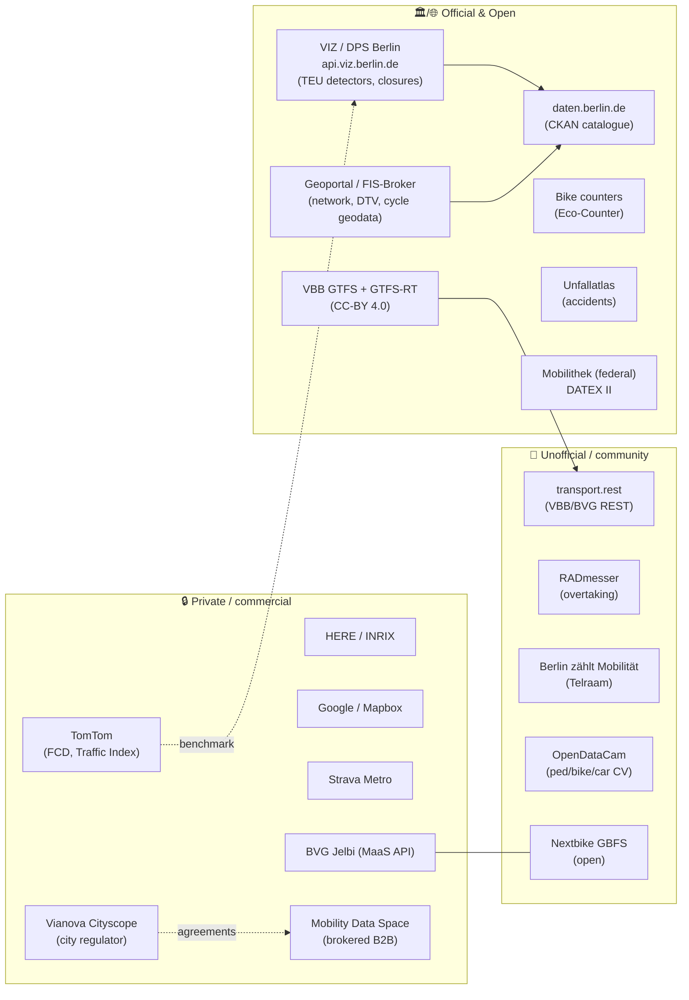

# 08 · Cross-cutting comparison & executive summary

> 🤖 Agent-generated synthesis of [`00`](00-platforms.md)–[`07`](07-commercial.md) (May 2026).
> Ratings are the agent's qualitative judgement from web research, not vendor SLAs.

---

## ⭐ Final executive summary

**Berlin is, overall, one of the better-instrumented and more openly-licensed
mobility-data cities in Europe — but the richness is wildly uneven across modes, and
the hard problem is integration, not licensing.**

Five takeaways:

1. **Public transport is best-in-class and fully open.** VBB publishes **GTFS** (twice
   weekly) and an official **GTFS-Realtime** feed (CC-BY 4.0, no auth, ~60 req/min),
   plus free community REST wrappers. If your project centres on transit, Berlin is
   close to a solved problem. *(Caveat: no official RT archive, no open occupancy.)*

2. **Car/road data is strong but split in two, with one structural gap.** You get
   **authoritative live point data** (240+ TEU detectors, volume/class/speed) and
   **authoritative periodic network data** (Verkehrsmengenkarte DTVw, multi-modal),
   both open (dl-de/by-2.0). The gap — **a citywide real-time travel-time / floating-car
   layer** — is exactly what you must **buy** (TomTom is the pragmatic default).

3. **Cycling punches above its weight via official + citizen data combined.** Sparse but
   precise counters (~20, daily) + complete network geodata + RADmesser/Telraam/Strava
   for breadth. Blend ground-truth counters with crowd data; neither alone is enough.

4. **Pedestrians and shared-mobility trips are the real blind spots.** Pedestrians are
   the **least instrumented** mode (open *tools* like OpenDataCam/Telraam exist, but few
   open *counts*). Shared-mobility **live availability is technically GBFS-standardised but
   legally gated** (only Nextbike/DB open); trip/OD data lives with operators and the city's
   regulator (Vianova/Mobility Data Space) and needs **agreements**.

5. **Freight inverts the usual pattern.** The freest, census-grade data (toll) is
   **off-street** (Autobahn, ≥7.5 t); surface-street/last-mile/parcel data thins to
   **modelled studies** and operator telematics.

**One-line guidance:** *Build on the open core — VBB GTFS/GTFS-RT, the TEU detectors,
the DTV map, the bike counters, the Unfallatlas, and Nextbike GBFS — then spend money in
exactly two places: a **floating-car/travel-time provider** (congestion) and, if needed,
**footfall/operator-trip data** (pedestrians + shared-mobility OD). The dominant cost is
**engineering to unify ≥5 portals and a dozen formats**, not data licences.*

---

## Data-maturity heatmap (open-data perspective)

Higher = better *open* availability/quality/usability. (●●● strong · ●●○ moderate · ●○○ weak)

```
Mode                 Live flow   Spatial coverage   Openness    Overall(open)
-------------------  ----------  -----------------  ----------  -------------
Public transport     ●●●         ●●●                ●●●         ●●●  ← best
Car / motorized      ●●○         ●●●                ●●●         ●●○
Cycling              ●●○         ●●○                ●●●         ●●○
Freight / truck      ●○○         ●●○                ●●○         ●●○
Shared mobility      ●●○*        ●●○                ●○○         ●○○   *gated
Pedestrian           ●○○         ●○○                ●●○         ●○○  ← weakest
```

## Ecosystem map



## Consolidated rating matrix

Axes: **Acc**ess · **Qual**ity · **Cov**erage · **Use**ability — ★ (low) ★★ (med) ★★★ (high).

| Source | Mode(s) | Prov. | Acc | Qual | Cov | Use |
| ------ | ------- | :---: | :-: | :--: | :-: | :-: |
| VBB GTFS (static) | PT | 🌐 | ★★★ | ★★★ | ★★★ | ★★★ |
| VBB GTFS-Realtime | PT | 🏛 | ★★★ | ★★★ | ★★★ | ★★★ |
| transport.rest wrappers | PT | 🤝 | ★★★ | ★★☆ | ★★★ | ★★★ |
| BVG/S-Bahn ridership (Zahlenspiegel) | PT | 🏛 | ★★★ | ★★☆ | ★★☆ | ★☆☆ |
| TEU traffic detectors (VIZ/DPS) | Car, Truck | 🏛 | ★★★ | ★★★ | ★★☆ | ★★☆ |
| Verkehrsmengenkarte (DTVw) | Car, Truck, Bike | 🏛 | ★★★ | ★★☆ | ★★★ | ★★☆ |
| Unfallatlas (accidents) | All | 🌐 | ★★★ | ★★★ | ★★★ | ★★★ |
| Parking (district) | Car | 🌐 | ★★☆ | ★★☆ | ★☆☆ | ★★☆ |
| Toll Collect / BALM stats | Truck | 🏛 | ★★☆ | ★★★ | ★★☆ | ★★☆ |
| Destatis truck-toll mileage index | Truck | 🏛 | ★★★ | ★★★ | ★★☆ | ★★★ |
| IWVK / Wirtschaftsverkehr studies | Truck | 🏛 | ★★☆ | ★★☆ | ★★☆ | ★☆☆ |
| Bike counters (Eco-Counter) | Bike | 🏛 | ★★★ | ★★★ | ★★☆ | ★★★ |
| Radverkehrsnetz geodata | Bike | 🏛 | ★★★ | ★★☆ | ★★★ | ★★☆ |
| RADmesser | Bike | 🤝 | ★★★ | ★★☆ | ★★☆ | ★★★ |
| Berlin zählt Mobilität (Telraam) | Bike, Ped, Car | 🤝 | ★★★ | ★★☆ | ★★☆ | ★★☆ |
| OpenDataCam / OpenTrafficCount | Ped, Bike, Car | 🤝 | ★★☆ | ★★☆ | ★☆☆ | ★★☆ |
| Nextbike GBFS | Sharing | 🤝 | ★★★ | ★★★ | ★★☆ | ★★★ |
| Other operator GBFS (Tier/Lime/Voi/Miles…) | Sharing | 🔒 | ★☆☆ | ★★★ | ★★☆ | ★★★ |
| BVG Jelbi MaaS API | Sharing, PT | 🔒 | ★☆☆ | ★★★ | ★★★ | ★☆☆ |
| Vianova Cityscope | Sharing | 🏛🔒 | ★☆☆ | ★★★ | ★★★ | ★★☆ |
| TomTom Traffic API/Stats | Car, Truck | 🔒 | ★★☆ | ★★★ | ★★★ | ★★★ |
| TomTom Traffic Index | Car | 🔒 | ★★★ | ★★★ | ★★☆ | ★★★ |
| HERE / INRIX | Car, Truck | 🔒 | ★★☆ | ★★★ | ★★★ | ★★☆ |
| Google / Mapbox | Car | 🔒 | ★★☆ | ★★★ | ★★★ | ★★☆ |
| Strava Metro | Bike, Ped | 🔒 | ★☆☆ | ★★☆ | ★★★ | ★★☆ |
| Footfall / location analytics | Ped | 🔒 | ★☆☆ | ★★☆ | ★★☆ | ★★☆ |

Provenance: 🏛 Official · 🌐 Open · 🤝 Unofficial/community · 🔒 Private.

## Recommended "starter stack" by use-case

| Use-case | Open core | Add commercial |
| -------- | --------- | -------------- |
| Transit app / analysis | VBB GTFS + GTFS-RT (+ transport.rest) | — |
| Road congestion / travel time | TEU detectors + DTV map | **TomTom Traffic API** |
| Safety / Vision Zero | Unfallatlas + Verkehrsmengenkarte | — |
| Cycling planning | Bike counters + Radverkehrsnetz + RADmesser | Strava Metro (agency) |
| Shared-mobility ops | Nextbike GBFS + Sondernutzung zones | operator GBFS / Vianova (agreement) |
| Pedestrian volumes | Telraam / OpenDataCam (DIY) | footfall vendor |
| Freight trends | Destatis toll index + DTV truck layer | HERE/INRIX or operator telematics |

## Cross-cutting insights

- **Licence is rarely the blocker.** dl-de/by-2.0, CC-BY 4.0, and GTFS dominate the open core.
  The friction is **discovery and integration** across ≥5 portals and ~10 formats.
- **"Live + citywide + complete" is the recurring gap.** Open data is strong on *two of three*
  per mode; the missing leg (usually real-time floating-car, or complete spatial coverage) is
  where commercial or DIY collection enters.
- **Governance, not technology, gates shared mobility.** GBFS exists; access is contractual.
- **Citizen science is a genuine tier in Berlin**, not a novelty — Telraam, RADmesser, and
  OpenDataCam materially extend official coverage for active modes.

## Sources

See the per-section files [`00`](00-platforms.md)–[`07`](07-commercial.md) for the full,
linked source lists underpinning every rating above.
