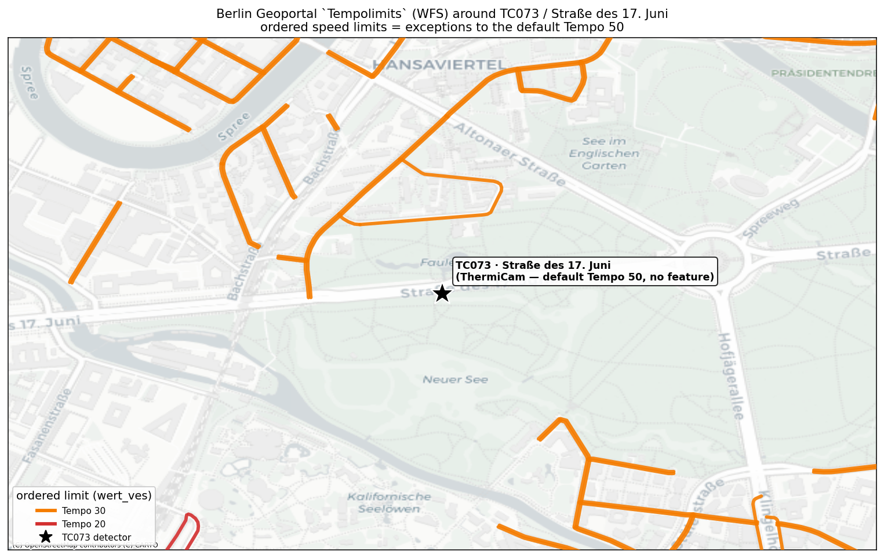

# Worked example — speed limits at the TC073 location (Straße des 17. Juni)

> 🤖 Verified by a **live WFS call on 2026-06-02**. Fully reproducible:
> `python3 query_and_plot.py` (re-fetches if `data/…geojson` is absent).

A concrete, located showcase of the Berlin Geoportal **`Tempolimits`** service —
deliberately centred on the **same spot the repo's detector deep dive studies**:
**TC073, Straße des 17. Juni** (`52.51376 N, 13.34194 E`), the ThermiCam site from
[`../../tc073-deepdive/`](../../tc073-deepdive/) and
[`../../teu-detectors-viz-api/thermicam-camera-map.md`](../../teu-detectors-viz-api/thermicam-camera-map.md).
It puts the *legal* limit layer next to the place we already have *measured*-speed data for.

## The map



*Geoportal `Tempolimits` segments in a ~900 m × 1.3 km box around TC073, coloured by
ordered km/h on a CartoDB basemap. **The single most informative thing on this map is
what's missing:** Straße des 17. Juni — the road the ★ detector sits on — has **no
coloured segment**, because the layer stores only **exceptions to the default Tempo 50**.
The dense orange to the north is the **Hansaviertel Tempo-30 zone**; the red stub is a
**Tempo-20** stretch.*

## What the data says here (live, 2026-06-02)

**63 segments** fall in the box — and they tell the "exceptions only" story cleanly:

| Ordered limit | Reason (`durch_t`) | count |
| --- | --- | ---: |
| Tempo 30 | angeordnete Verkehrseinschränkung | 51 |
| Tempo 30 | Verkehrssicherheit | 3 |
| Tempo 30 | Schulwegsicherung | 3 |
| Tempo 30 | Lärmschutz | 2 |
| Tempo 30 | Lärmschutz, Schulwegsicherung | 1 |
| Tempo 20 | Verkehrssicherheit | 3 |

- **Nearest ordered limit to the detector: a Tempo 30 segment 221 m away**
  (`elem_nr 42540015_42540009.02`, no time/day restriction).
- **Straße des 17. Juni itself: absent ⇒ default Tempo 50.** So the legal limit where
  TC073 measures traffic is **50** — which lines up with the deep dive's observed
  free-flow band (~53 km/h) and the inferred *temporary* 30/roadworks dip in Feb that is
  **not** in this static layer. Static legal limit (this layer) and measured/temporary
  speed (the detector) are different things — this example shows both at one point.

## API spec used

| | |
| --- | --- |
| Endpoint | `https://gdi.berlin.de/services/wfs/tempolimits` |
| Operation | `GetFeature` · **WFS 2.0.0** |
| Feature type | `tempolimits:hoechstgeschwindigkeit` |
| Spatial filter | `BBOX(geom, 13.32894, 52.50776, 13.35494, 52.51976, 'EPSG:4326')` (CQL; axis order **lon,lat**) |
| Output format | `application/json` (GeoJSON) — **also** GML 3.2 (default), WMS image, CSV |
| CRS | requested **EPSG:4326**; native storage **EPSG:25833** |
| Auth / licence | none · **dl-de/zero-2.0** (no attribution required) |

The exact request (URL-encoded by the script):

```bash
curl -s -A 'research-bot/1.0' \
 'https://gdi.berlin.de/services/wfs/tempolimits?service=WFS&version=2.0.0&request=GetFeature&typeNames=tempolimits:hoechstgeschwindigkeit&outputFormat=application/json&srsName=EPSG:4326&cql_filter=BBOX(geom,13.32894,52.50776,13.35494,52.51976,%27EPSG:4326%27)'
```

## Formats — one feature, three ways

The GeoJSON the script stores (`data/tempolimits_str17juni.geojson`); one feature:

```json
{
  "type": "Feature",
  "geometry": { "type": "MultiLineString", "coordinates": [[[13.3386, 52.5180], …]] },
  "properties": {
    "gisid": …, "elem_nr": "42540015_42540009.02",
    "wert_ves": 30, "durch_t": "angeordnete Verkehrseinschränkung",
    "zeit_t": null, "tag_t": null, "dann_t": null, "dat_t": null
  }
}
```

- **GML 3.2** — drop `&outputFormat=application/json` (GeoServer's default); same fields,
  XML envelope, coordinates in EPSG:25833 unless `srsName` overrides.
- **WMS image** — swap to `…/services/wms/tempolimits?…request=GetMap&layers=…&bbox=…`
  for a rendered PNG (what VIZ shows on a map).
- **CSV** — `&outputFormat=csv` for the attribute table without geometry handling.

Field meanings are documented in [`../fis-broker-tempolimits.md`](../fis-broker-tempolimits.md).

## Files

| File | What |
| --- | --- |
| [`query_and_plot.py`](query_and_plot.py) | one-request fetch → prints API spec/summary → renders the map (stdlib + matplotlib + contextily; Web-Mercator inlined, no pyproj) |
| `data/tempolimits_str17juni.geojson` | the 63-feature snapshot returned by the live WFS call |
| `figures/tempolimits_str17juni.png` | the static map above |

## Takeaway

At a *single* real location you can see the whole design of Berlin's open speed-limit
data: an **authoritative WFS** gives you the **ordered Tempo-30/20 exceptions with their
legal reason** (noise, school route, safety), in standard OGC formats under the most
permissive licence — but the **default-50 arterial in the middle is invisible** unless you
combine it with OSM (which tags the 50 too). See [`../README.md`](../README.md) for the
OSM-vs-Geoportal split.
</content>
