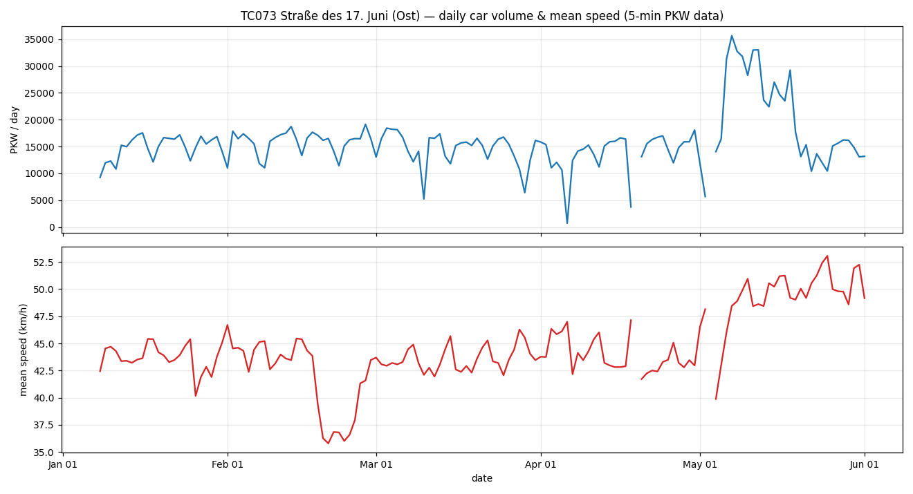
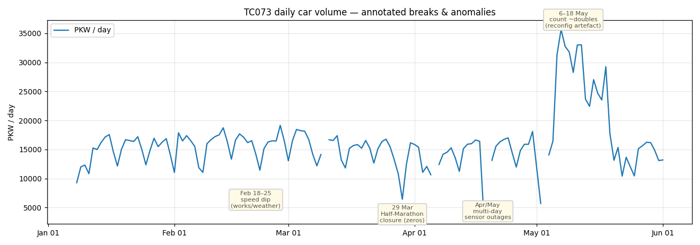
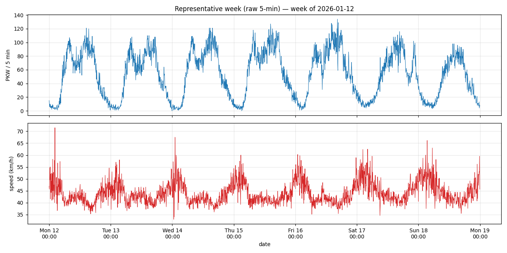
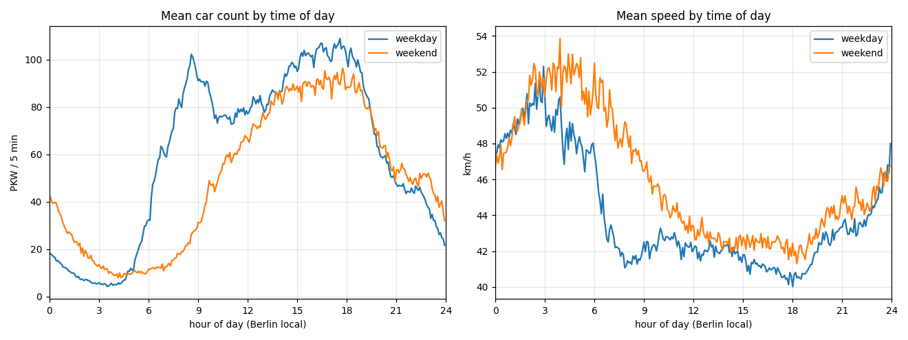
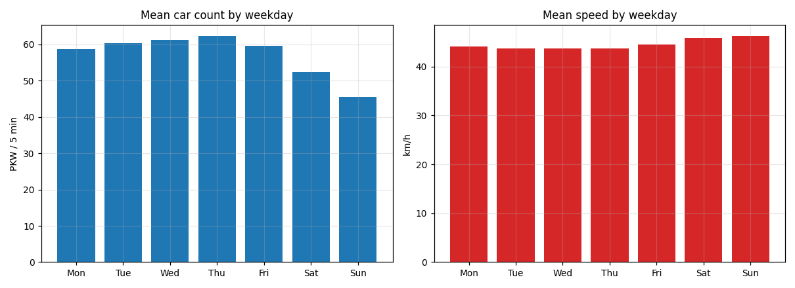
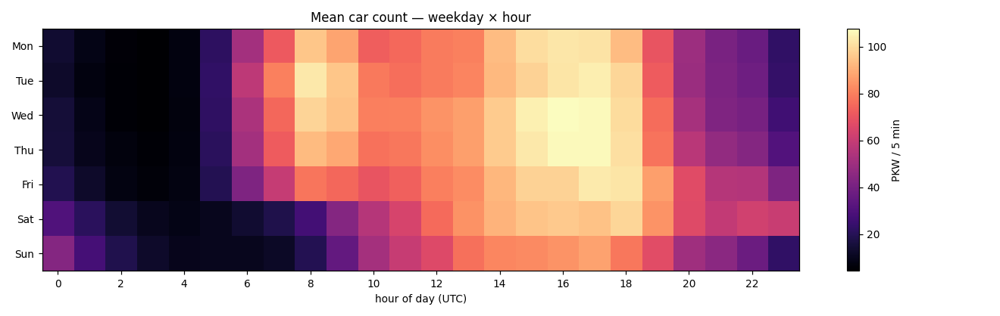
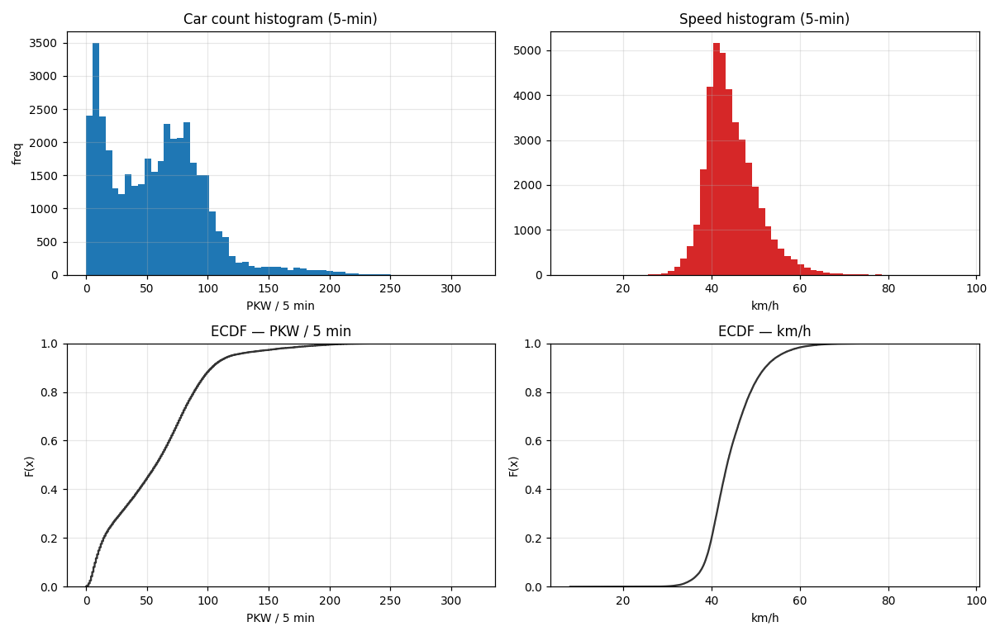
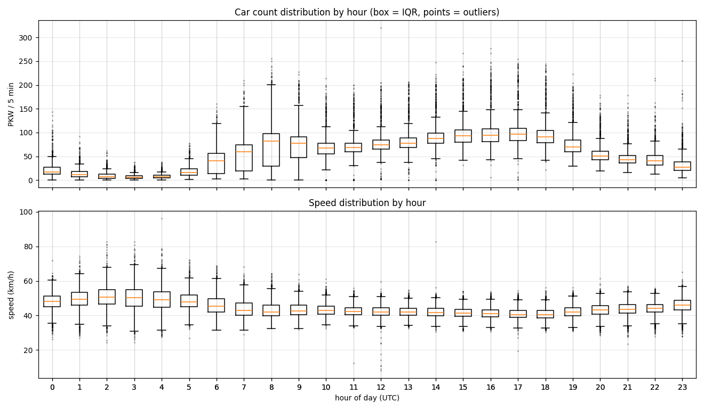
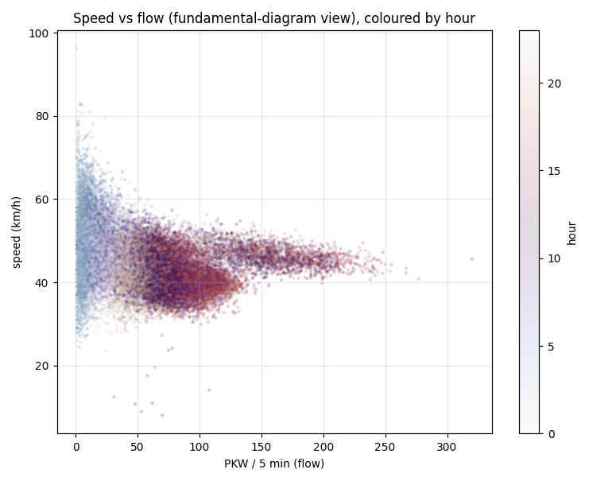
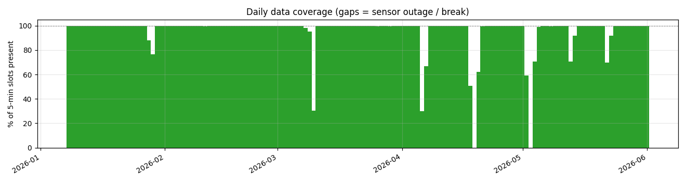

# TC073 deep dive — Straße des 17. Juni car (PKW) flow & speed at 5-min resolution

> 🤖 Generated by a coding agent — not human-verified. Data pulled from the Berlin
> VIZ/DPS **ThermiCam** OGC SensorThings (FROST) server on 2026-06-01. Licence
> dl-de/by-2.0, attribution *"Senatsverwaltung für Verkehr Berlin / Digitale
> Plattform Stadtverkehr Berlin"*. **Raw data is not committed** (re-fetch with
> `fetch.py`); figures and code are.

## Executive summary

A single-site drill-down on **TC073 — Straße des 17. Juni, between Klopstockstr. and
Großer Stern, direction Ost** (Tiergarten, Mitte; 52.5138 N, 13.3419 E), the
boulevard running to the Brandenburg Gate. We retrieved **every 5-minute PKW (car)
count and speed observation** on the cross-section (`Messquerschnitt`) over the
detector's full life so far (**2026-01-08 → 2026-06-01**, 39,674 observations,
**95.5 % grid fill**) and analysed time-series, daily/weekly/diurnal structure, the
statistical distributions, and every break/outlier.

The data is **physically sound** — a textbook bimodal commuter profile, a clean
inverse speed↔flow relationship, and a near-normal speed distribution (median
**43.5 km/h**, count median **57 PKW/5 min**). The interesting part is the
**breaks**, which split cleanly into **real traffic events** and **measurement
artefacts**:

| When (local) | Signature | Classification | Evidence / cause |
| --- | --- | --- | --- |
| **Sun 29 Mar, ~08:20–11:40** | `count = 0` for ~3 h (camera up) | ✅ **real closure** | **45. Berliner Halbmarathon** — Straße des 17. Juni course closed 07:45→~15:00 |
| **18–25 Feb** | mean speed ~36 km/h (vs ~43), volume normal | ✅ **real** | sustained **−7 km/h** → temporary speed limit / roadworks (or a cold spell); cause not independently confirmed |
| **6–18 May** | daily count **~doubles** *and* speed steps up | ⚠️ **artefact** | physically impossible combo; begins right after the 2–4 May outage → **sensor reconfiguration / re-scaling** |
| **Fri 8 May, 11:40–12:20** | 130 → **0** → 248 PKW/5 min in 40 min | ⚠️ **artefact** | transient **sensor dropout**; tell-tale "4 cars @ 82.8 km/h" blip mid-gap |
| **9 multi-hour gaps** (e.g. 18–20 Apr, 2–4 May) | data **missing** (no row), speed also gone | ⚠️ **artefact** | **sensor / comms outages** — distinct from closures, which keep reporting zeros |

> **Key insight:** the distinction *"missing observation" vs "present-but-zero"* is
> the whole game. A **closed street** keeps the camera running and reports **`count = 0`**
> (the marathon); a **dead sensor** reports **nothing at all** (the multi-day gaps).
> Conflating the two — as a naive "no count = closure" rule would — gets every case
> wrong. Separately, the most consequential anomaly here is **not** a gap at all but
> a silent **doubling of counts in May** that any unsuspecting trend analysis would
> read as a real traffic surge.

## Site & data

| | |
| --- | --- |
| Thing | `TC073` (id 72), status `active`, Bezirk Mitte / Tiergarten |
| Location | Straße des 17. Juni, Klopstockstr.→Großer Stern, **Richtung Ost**, 10557 |
| Datastreams | count `Anzahl PKW 5 Minuten -  Messquerschnitt` (id **25837**); speed `Geschwindigkeit PKW 5 Minuten -  Messquerschnitt` (id **25843**) |
| Span | 2026-01-08 10:55 → 2026-06-01 15:45 UTC |
| Grid | 41,554 five-minute slots · **39,674 present (95.5 %)** · 1,880 missing · 79 present-but-zero |
| Count (PKW/5 min) | median 57 · mean 57.3 · p95 120 · max 320 |
| Speed (km/h) | median 43.5 · mean 44.6 · p05 36.9 · p95 55.4 |

All times in the data are **UTC**; diurnal/weekday analysis is done in **Europe/Berlin
local time** (the sample crosses the 29 Mar DST change).

## Time series & patterns


*Daily car volume (top) and mean speed (bottom). Note the May count surge with
simultaneously **rising** speed — the artefact discussed below.*




*A representative full week at native 5-min resolution — clean diurnal cycles.*


*Weekday volume is bimodal (≈08–09 h and ≈16–18 h rushes); weekend volume has no
morning peak and runs later. Speed mirrors flow inversely — fastest ~03–05 h
(~53 km/h), slowest at rush (~40 km/h).*

 &nbsp; 
*Weekday means and the hour×weekday volume heatmap — the commuter ridge on Mon–Fri,
the broad weekend afternoon block.*

## Statistical view


*Count is bimodal (night low-count peak + daytime hump, tail to 320); speed is
near-normal around 43 km/h with a thin free-flow tail. ECDFs (EDF) at right.*


*Per-hour boxplots: count IQR widens through the day; speed is tightest and highest
overnight. Low-speed fliers are congestion/incidents.*


*Speed–flow ("fundamental diagram") view coloured by hour: free-flow scatter at low
night flow collapsing onto a ~40–48 km/h daytime band. The road rarely reaches jam
density — and the high-flow (>200) points sit at *normal* speed, consistent with the
May counts being inflated rather than real congestion.*

## Breaks & outliers — full analysis

Detection is mechanical and reproducible: reindex onto the complete 5-minute grid,
then flag (a) **missing** slots (no observation) and (b) **present-but-zero** slots,
and group each into runs ≥ 30 min. The runs are in `data/outages.csv`
(coverage shown below).



### 1. Real traffic event — Berlin Half-Marathon (29 Mar)
The only **present-but-zero** run of real-world origin: `count = 0` from ~08:20 to
~11:40 local on Sunday 29 Mar, with the camera still reporting (speed simply `NaN`,
no cars to time). This matches the **45. Berliner Halbmarathon**, which closed
Straße des 17. Juni from 07:45 with progressive reopening to ~15:00. TC073 sits just
west of the Großer Stern start area, inside the closed zone. The 29 Mar DST
spring-forward is the **same day but not the cause** (a clock artefact would be ~1 h,
not a closure-shaped 3 h+ daytime void). *(Note: the multi-day central-section
closure 27–30 Mar covered Großer Stern→Brandenburger Tor, **east** of TC073, so only
the Sunday whole-route closure shows here.)*

### 2. Real signal — late-February speed dip
18–25 Feb: mean speed sits at **~36 km/h vs the ~43 km/h baseline** for eight days
with **normal volume**. A sustained, flat speed reduction with unchanged flow points
to a **temporary speed limit / roadworks** (Straße des 17. Juni has planned
City-S-Bahn construction) or a cold/icy spell. Real, but the specific cause is **not
independently confirmed**.

### 3. Artefact — the May count doubling (6–18 May)
Daily mean count jumps from ~57 to **~110–124 PKW/5 min overnight (5→6 May)** and
reverts ~18–19 May, while **mean speed simultaneously rises** (~43 → ~49 km/h). More
cars at higher speed is not real traffic. The jump lands **immediately after the
2–4 May sensor outage**, so the parsimonious explanation is a **reconfiguration /
re-scaling of the detector** during that downtime (e.g. a changed lane aggregation).
Worth confirming against the per-lane datastreams. **Caution:** a naive trend or
YoY comparison spanning May would silently inherit this artefact.

### 4. Artefact — transient dropouts and outages
- **8 May 11:40–12:20** — counts collapse `130 → 0 → 248` within 40 min midday
  Friday, with a single `4 cars @ 82.8 km/h` partial reading mid-gap: a textbook
  **momentary sensor dropout reported as zero**, not a closure.
- **9 "missing" runs** (≥30 min), incl. **18–20 Apr (~45 h)** and **2–4 May (~41 h)**:
  no observations at all (speed missing too) → **sensor/communications outages**.
  These cause the deep daily-volume dips on the overview that are *not* low traffic.

| kind | start (UTC) | end (UTC) | minutes | reading |
| --- | --- | --- | --- | --- |
| missing | 2026-01-28 04:00 | 2026-01-28 06:50 | 175 | outage |
| missing | 2026-01-29 00:25 | 2026-01-29 06:15 | 340 (2 runs) | outage |
| missing | 2026-03-09 21:50 | 2026-03-10 15:40 | 1075 | outage |
| **zero** | **2026-03-29 06:20** | **2026-03-29 09:40** | **205** | **marathon closure** |
| missing | 2026-04-06 05:10 | 2026-04-07 05:55 | 1490 | outage (Easter Mon) |
| missing | 2026-04-18 10:10 | 2026-04-20 07:00 | 2695 | outage |
| missing | 2026-05-02 12:10 | 2026-05-04 05:00 | 2455 | outage → precedes reconfig |
| **zero** | **2026-05-08 11:40** | **2026-05-08 12:10** | **35** | **sensor dropout** |
| missing | 2026-05-13 15:15 | 2026-05-13 23:55 | 525 | outage |
| missing | 2026-05-22 14:50 | 2026-05-22 23:55 | 550 | outage |

A useful cross-check: across the whole sample **`speed > 0` while `count = 0` never
happens** (0 cases) — the count and speed streams are mutually consistent, which is
why the May-8 zero-with-`NaN`-speed reads as a clean dropout rather than a data
mismatch.

## Reproduce

```bash
cd berlin-traffic-groundwork/tc073-deepdive
python3 fetch.py        # idempotent + gentle: caches data/tc073_pkw_5min.csv (skips if present)
python3 analyze.py      # deterministic: regenerates figures/ + data/{outages,summary}.json
```

- **Gentle on the API** (see [`../../AGENTS.md`](../../AGENTS.md) → *Be a good
  citizen*): `fetch.py` is sequential, month-windowed, ~0.35 s between calls, with
  exponential backoff; it re-discovers the datastream IDs by name so it survives ID
  changes, and **does nothing if the CSV already exists** (`--force` to override).
- **Idempotent / reproducible:** `analyze.py` is a pure function of the cached CSV
  (no network) and overwrites figures deterministically.
- **Data is git-ignored** (`.gitignore`) — only code, figures, and this writeup are
  committed, so the analysis can be re-run but the bulk observations are not stored
  in version control.

## Caveats

- The **May reconfiguration** and **Feb speed dip** causes are **inferred, not
  source-confirmed**; the marathon closure **is** confirmed (VIZ notice).
- PKW only (the user's "car"); the cross-section also exposes LKW, Lieferwagen, Krad,
  Bus, Fahrrad, Fußgänger and a KFZ total, plus per-lane variants (see
  [`../teu-detectors-viz-api/api-reference.md`](../teu-detectors-viz-api/api-reference.md#datastream-anatomy--why-one-site-has-hundreds-of-datastreams)).
- Five months is too short for seasonal conclusions; treat as a methodology + data-
  quality study, not a traffic census.

## Sources

- [VIZ Berlin — Verkehr zum 45. Berliner Halbmarathon am 29. März 2026](https://viz.berlin.de/aktuelle-meldungen/verkehr-zum-45-berliner-halbmarathon-am-29-marz-2026/)
- [Tagesspiegel — Berliner Halbmarathon 2026: Strecke, Sperrungen, Rahmenprogramm](https://www.tagesspiegel.de/berlin/berliner-halbmarathon-2026-alles-rund-um-strecke-sperrungen-und-rahmenprogramm-15399712.html)
- ThermiCam SensorThings API: `https://api.viz.berlin.de/FROST-Server-ThermiCam/v1.1` · [DPS Verkehrsdetektion](https://api.viz.berlin.de/daten/verkehrsdetektion)
