# TE180 deep dive — Torstraße (West) car (PKW) flow & speed at 5-min resolution

> 🤖 Generated by a coding agent — not human-verified. Data pulled from the Berlin
> VIZ/DPS **legacy TEU** OGC SensorThings (FROST) server on 2026-06-02. Licence
> dl-de/by-2.0, attribution *"Digitale Plattform Stadtverkehr Berlin /
> Verkehrsdetektion Berlin"*. **Raw data is not committed** (re-fetch with
> `fetch.py`); figures and code are. Built as a direct counterpart to
> [`../tc073-deepdive`](../tc073-deepdive) — same method, a different sensor class.

## Executive summary

A single-site drill-down on **TE180 — Torstraße, between Tucholskystr. & Borsigstr.
(in front of Haus 199), direction West** (Berlin-Mitte; 52.52810 N, 13.39158 E), one
of the **8 Torstraße TEU infrared lane detectors** ([`../teu-detectors-viz-api/torstrasse-live-query.md`](../teu-detectors-viz-api/torstrasse-live-query.md)).
We retrieved **every 5-minute PKW (car) count and speed observation** at the
cross-section (`Messquerschnitt`) level for the detector's **first and only dense
year** (**2023-02-22 → 2024-01-13**, after which the sensor goes dark; status
`n.o.k.`), and ran the *same* time-series / diurnal / distribution / break analysis
as the TC073 study so the two are directly comparable.

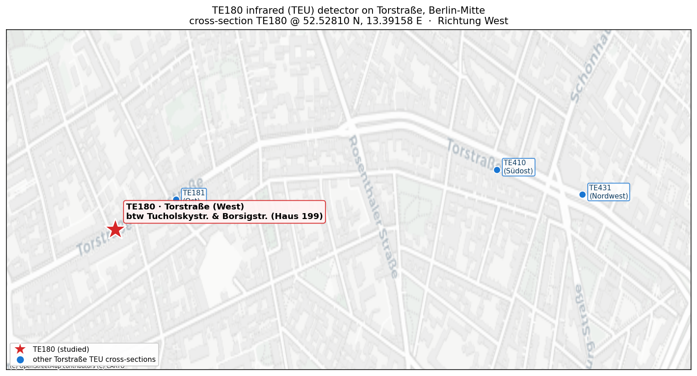

The data is **physically sound and remarkably artefact-free** — no count-doubling
re-scaling event like TC073's, a textbook inverse speed↔flow relationship, and a
near-normal speed distribution (median **36.4 km/h**, count median **34 PKW/5 min**).
Two things stand out against TC073:

| | **TE180** Torstraße (West) | **TC073** Str. d. 17. Juni (Ost) |
| --- | --- | --- |
| Sensor class | **TEU passive-infrared** (frozen/legacy) | ThermiCam thermal (live) |
| Diurnal shape | **single sharp AM peak** (~08:00, ~62/5 min) | symmetric **bimodal** (AM+PM) |
| Count median | **34** PKW/5 min | 57 PKW/5 min |
| Speed median | **36.4 km/h** | 43.5 km/h |
| Breaks | **100 % "missing"** runs; **0** present-but-zero | mix incl. a marathon-closure zero-run |

> **Key insight (device-class edition):** TC073 taught that *"missing ≠ zero"* — a
> closed street keeps the camera reporting `count = 0`. TE180 shows the **other
> half** of that rule: the legacy **TEU infrared detector never emits zeros at all**
> when something is wrong — it simply **stops reporting**. Every one of its 33
> ≥30-min breaks (incl. an **11-day Christmas/New-Year gap**) is *missing data*, not
> a measured lull. So the same naive "no count = closure" rule that over-counts
> closures on ThermiCam would, on TEU, **mistake every multi-day sensor outage for an
> empty street.** The reporting convention is sensor-specific, and you have to know
> which one you're holding.

## Site & data

| | |
| --- | --- |
| Thing | `TE180` (id **80**), status **`n.o.k.`** (nicht o.k.), Bezirk Mitte |
| Location | Torstraße, Tucholskystr.→Borsigstr., Haus 199, **Richtung West** (`mq_id15` 100201010015336) |
| Datastreams | count `Anzahl PKW 5 Minuten -  Messquerschnitt` (id **8725**); speed `Geschwindigkeit PKW 5 Minuten -  Messquerschnitt` (id **8731**) |
| Stream life | 2023-02-22 → ~2025-04-13, but **dense only in year 1**; we pull **2023-02-22 12:00 → 2024-01-13 01:35 UTC** |
| Grid | 93,476 five-minute slots · **82,195 present (87.9 %)** · 11,281 missing · 46 present-but-zero (all scattered, no ≥30-min run) |
| Count (PKW/5 min) | median 34 · mean 33.4 · p95 61 · max 100 (after artefact scrub; see below) |
| Speed (km/h) | median 36.4 · mean 36.3 · p05 27.0 · p95 45.0 |

All times in the data are **UTC**; diurnal/weekday analysis is done in **Europe/Berlin
local time**. The cross-section value is the aggregate of TE180's two lane detectors
(`TEU00180_Det0/_Det1`); see the datastream anatomy in
[`../teu-detectors-viz-api/api-reference.md`](../teu-detectors-viz-api/api-reference.md#datastream-anatomy--why-one-site-has-hundreds-of-datastreams).

## Time series & patterns

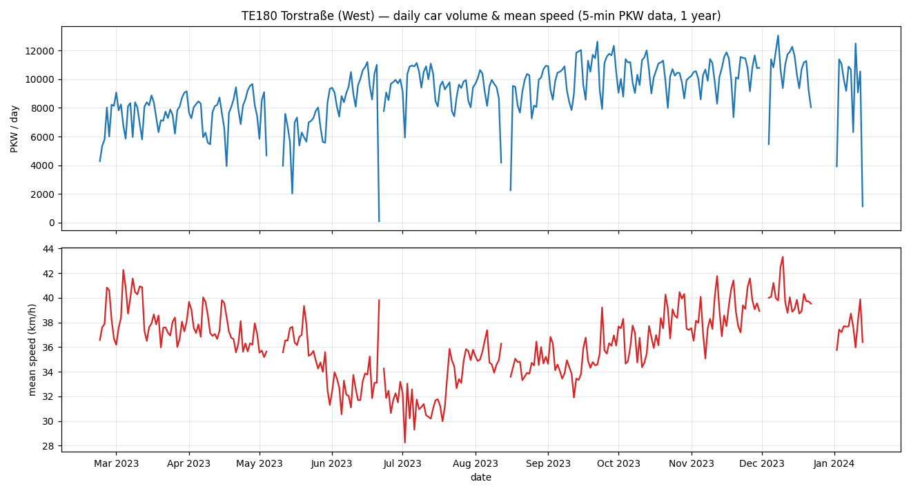
*Daily car volume (top, ~8–12 k PKW/day) and mean speed (bottom). Volume drifts up
from spring into autumn/winter; mean speed **dips through June–July 2023 (~32 km/h)**
and recovers to ~40 km/h by autumn — a candidate roadworks/seasonal effect, **not
source-confirmed**. Deep volume notches are **sensor outages**, not low-traffic days.*

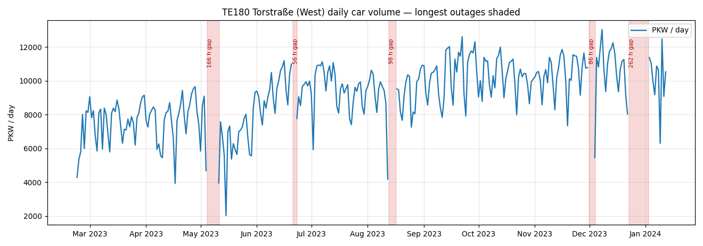
*Same daily volume with the five longest data gaps shaded — note the **~11-day
Christmas/New-Year outage** (22 Dec → 2 Jan) and the **~7-day early-May gap**.*

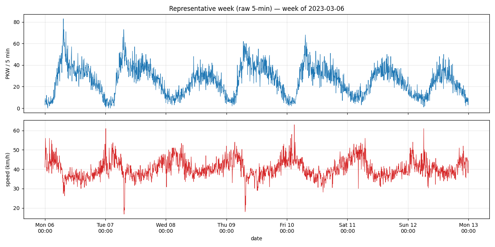
*A representative full week at native 5-min resolution (week of 2023-03-06): clean,
strongly **single-peaked weekday mornings**, lighter symmetric weekends.*

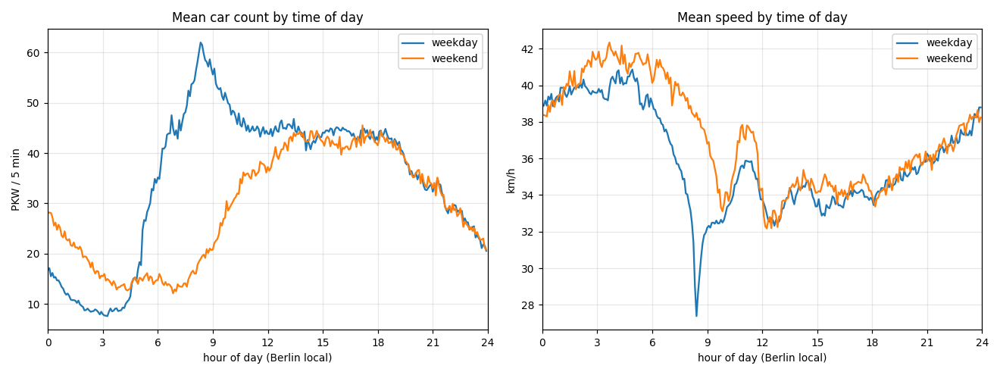
*The signature result. Being a **one-direction (West) cross-section**, TE180 has a
**single dominant morning peak** (~08:00–09:00 local, ~62 PKW/5 min) rather than
TC073's twin rushes — westbound commuters into the centre. **Speed collapses to
~27 km/h at exactly that 08:00 peak** (clean inverse of flow), recovers to ~33–35
midday, and runs ~40 km/h free-flow overnight. Weekends have no morning peak, a
broad afternoon, and higher speeds.*

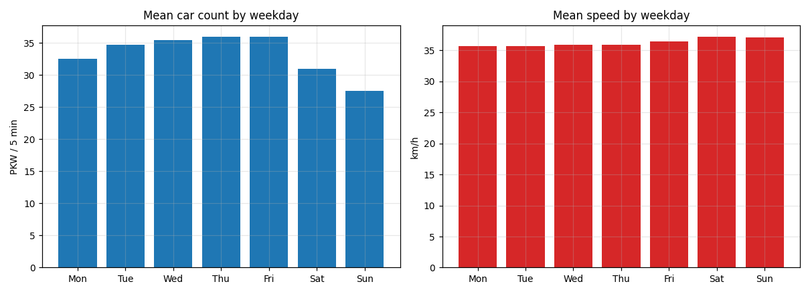 &nbsp; 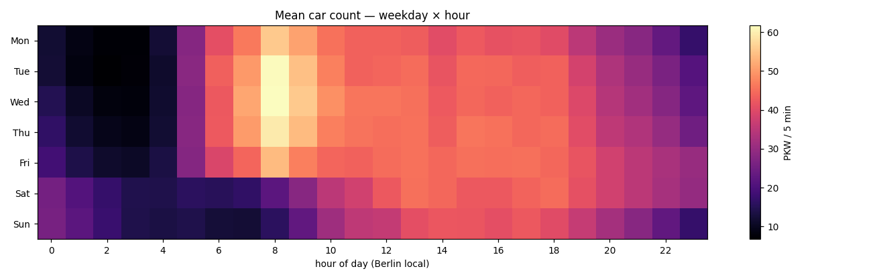
*Weekday means and the hour×weekday volume heatmap — the Mon–Fri morning ridge and
the broader, later weekend block.*

## Day-pattern decomposition (by month / week / day of week)

The single time-of-day curve above (fig. 03) averages over the whole year. These
three figures **break that diurnal profile apart** to show how its *shape* drifts
over time, each with **weekday (Mon–Fri) and weekend (Sat–Sun) in separate panels**
(six plots in all). Every line is one group's mean PKW count by hour (Berlin local,
5-min resolution); all use a **progressive `viridis` ramp** so chronology reads
straight off the colour — **dark purple = earliest, bright yellow = latest**.

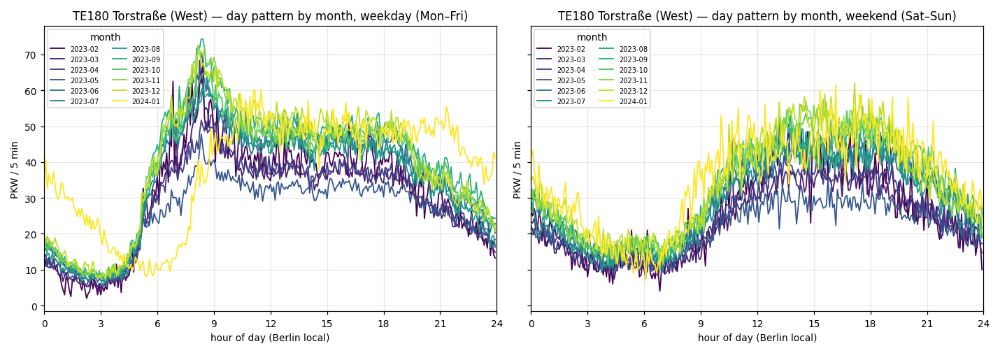
*One line per **month** (2023-02 → 2024-01). The weekday morning peak holds its
~08:00 position year-round while **daytime volume stratifies seasonally** — the
brighter (autumn/winter) lines sit above the darker (late-winter/spring) ones,
matching the slow volume rise in the daily overview. Weekends keep the same broad
midday plateau across all months.*

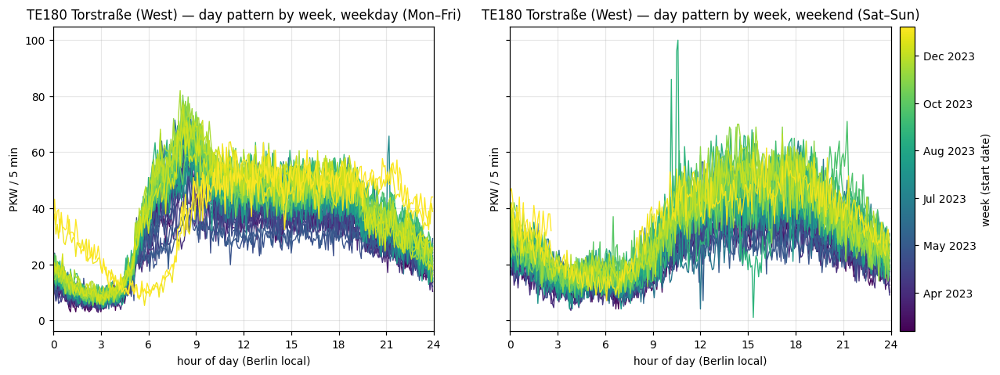
*Same idea at **weekly** resolution (~48 weeks; the colour **bar** replaces a legend
that many lines would swamp). The dense band makes the **week-to-week spread** of the
profile visible, and the colour gradient shows the seasonal drift is monotone rather
than noisy.*

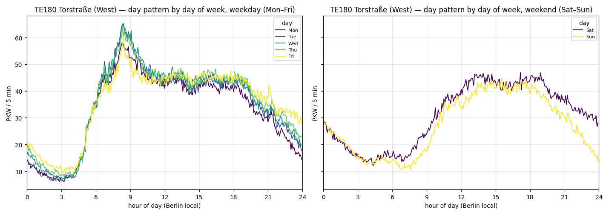
*One line per **day of week**. Mon–Fri are tightly bunched with the shared sharp
~08:00 commute spike (Friday's afternoon runs slightly longer); the weekend panel
shows **no morning peak at all** — a broad 12:00–18:00 plateau with **Saturday
sitting just above Sunday**.*

## Friday vs Saturday — whole-day trajectory bands

Where the decomposition above plots *group means*, this view keeps the **individual
days intact**. Each faint line is **one real Friday (or Saturday)** — that specific
date's complete 24-hour car-count profile at native 5-min resolution (Berlin local),
an **actual trajectory, not a per-bin reshuffle**. Lines are tinted by **calendar
month** on a gentle cyclic ramp (**blue = winter → yellow = summer → blue**), so the
seasonal stratification of the whole day is legible at a glance.

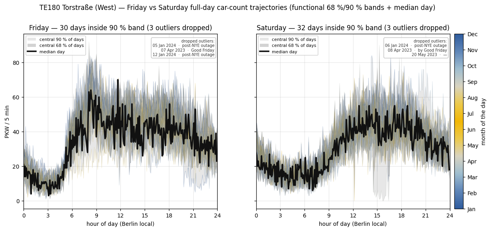
*Fri (left) / Sat (right); after the ≥95 % slot-coverage filter, **only the days
inside the 90 % band are drawn** (30 of 33 Fri, 32 of 35 Sat — the ~10 % depth
outliers are dropped). Over the real trajectories sit two **functional credible
bands** and a **median day**, all built from **Modified Band Depth** (MBD;
López-Pintado & Romo 2009 — the engine of the functional boxplot). MBD ranks each
whole curve by how often it lies inside the band spanned by pairs of other days; the
**central 68 % / 90 %** envelopes are then the pointwise min–max of the deepest 68 %
/ 90 % of days (darker-narrow vs lighter-wide grey), so the band literally
**contains that share of entire days** rather than being a pointwise quantile. The
bold near-black line is the **functional median = the single deepest real day** (a
genuine trajectory, not a synthetic average). Each panel's box lists the **dropped
outlier days and whether they fell on a holiday** (see below).*

Reading it: both nights share the weekday→weekend signature — **no sharp 08:00
commute spike**, a slow build to a broad afternoon/evening plateau, and a fat late
band. **Friday** carries the heavier, longer-tailed evening; **Saturday** is gentler
and earlier-tapering. The 90 %/68 % gap is widest in the afternoon/evening (day-to-day
variance peaks when the street is busy) and pinches tight in the **04:00–05:00
trough**, where every weekend looks alike. The month colour shows summer (yellow)
days running a touch higher through the long evenings than winter (blue) ones.

**The outliers are interpretable, and the holidays line up.** Of the six dropped days,
the two genuinely *low* ones are the **Easter long weekend** — **Good Friday, 07 Apr
2023** (a Berlin public holiday; the street runs Sunday-quiet) and the **Holy Saturday
beside it, 08 Apr 2023**. The high-side outliers are all the **first Fri/Sat after the
sensor woke from its 10.9-day Christmas/New-Year outage** (05/06/12 Jan 2024) —
return-to-work weeks running hot against the winter norm. The remaining one, **20 May
2023 (Sat)**, is an ordinary quiet Saturday, no holiday. Worth stating explicitly:
**Christmas (25–26 Dec) and New Year (1 Jan) cannot appear as outliers at all** —
both fall *inside* the sensor outage, so no trajectory exists for them.

The same picture with the **bands and median stripped out and every day kept** — the
raw trajectory set, coloured by month — is below. It makes the full day-to-day spread
visible (the band figure is just this with a robust summary laid over it):

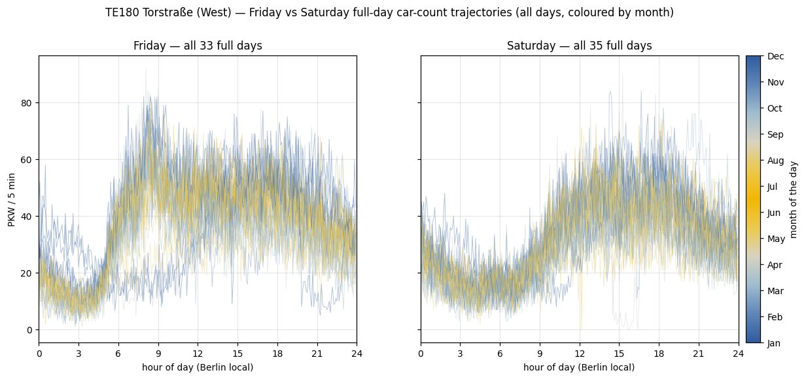
*All 33 Fri / 35 Sat full days, no bands, no median, one line per real day, coloured
by month. The seasonal fan-out is clearest in the evening hours; the overnight troughs
and the absence of an 08:00 commute spike are common to every day regardless of month.*

## Statistical view

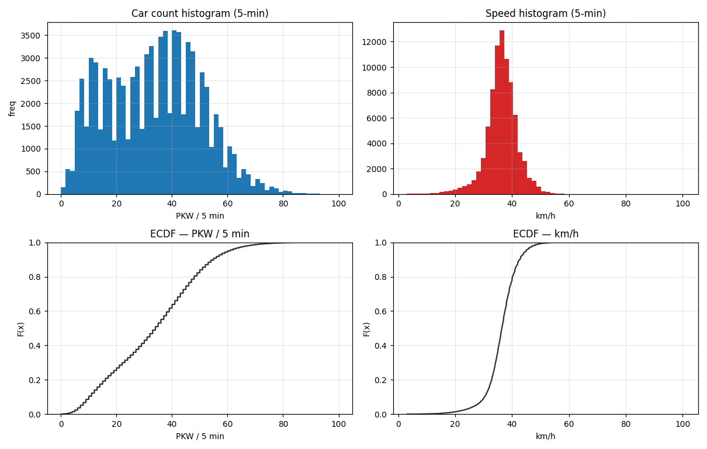
*Count is **bimodal** (overnight low-count peak + daytime hump, tail to ~95); speed
is **near-normal and tight** around 36–38 km/h with a thin free-flow tail. ECDFs at
bottom: ~80 % of 5-min slots carry ≤50 PKW; ~90 % of speeds fall in 30–45 km/h.*

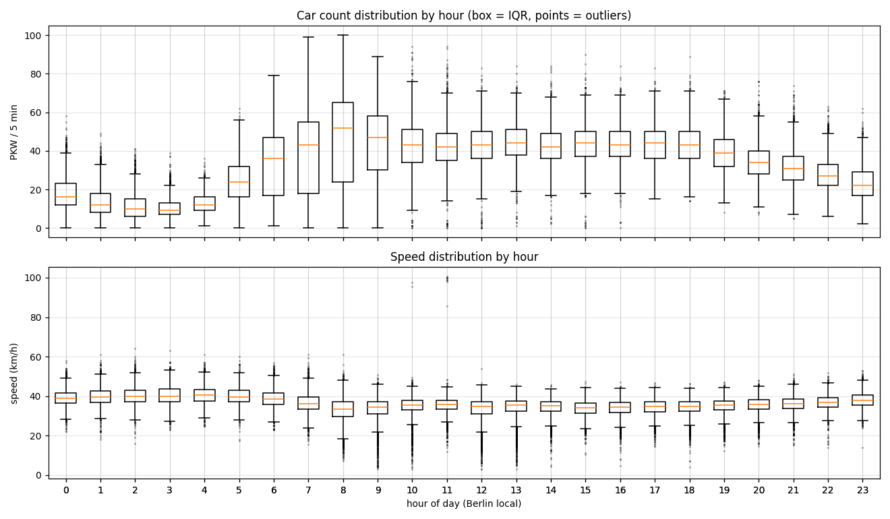
*Per-hour boxplots: count IQR widens through the day; speed is highest/tightest
overnight and lowest at the morning peak. Low-speed fliers are congestion.*

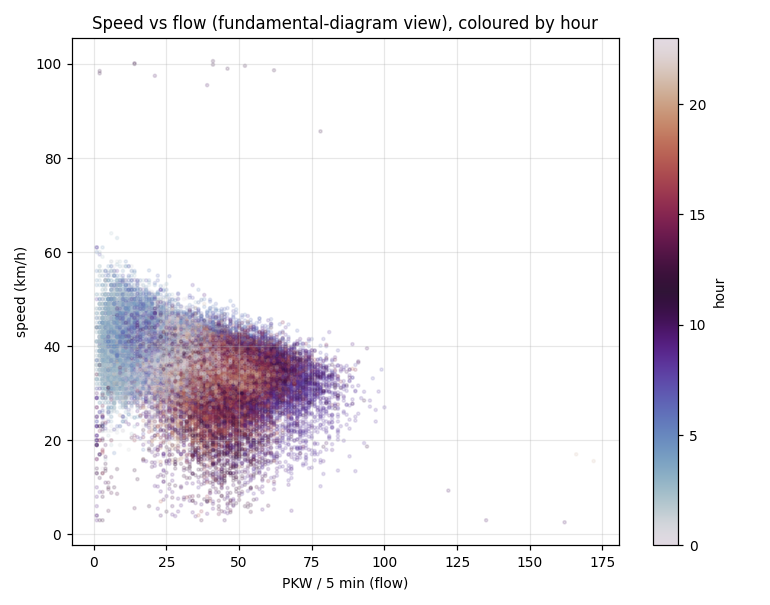
*Speed–flow ("fundamental diagram") coloured by hour: a free-flow cloud at low night
flow (~40–50 km/h, light) collapsing onto a ~25–35 km/h daytime congested band
(dark) as flow rises past ~50/5 min — a clean, monotone inverse relationship with
**no sign of a re-scaling artefact**. The handful of **~98–100 km/h points at
near-zero flow** are single-vehicle speed reads in otherwise-empty intervals.*

## Breaks & outliers — full analysis

Detection is mechanical and reproducible (identical to TC073): reindex onto the
complete 5-minute grid, then flag (a) **missing** slots and (b) **present-but-zero**
slots, and group each into runs ≥ 30 min. The runs are in `data/outages.csv`.

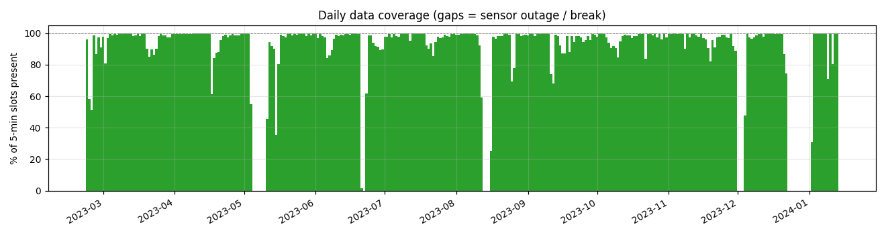

**All 33 significant runs are `missing` — there is not a single present-but-zero run.**
That is the headline finding: unlike ThermiCam (which reported `count = 0` through
the 29-Mar marathon closure), this **TEU infrared detector goes silent** rather than
reporting zeros. The 46 scattered present-but-zero 5-min slots never form a run and
sit, as expected, in the deep overnight hours.

| start (UTC) | end (UTC) | duration | reading |
| --- | --- | --- | --- |
| 2023-05-04 12:15 | 2023-05-11 10:50 | **~6.9 d** | sensor/comms outage |
| 2023-06-20 22:25 | 2023-06-23 07:05 | ~2.4 d | outage |
| 2023-08-12 13:30 | 2023-08-16 15:45 | **~4.1 d** | outage |
| 2023-11-30 21:35 | 2023-12-04 11:30 | ~3.6 d | outage |
| **2023-12-22 16:50** | **2024-01-02 15:20** | **~10.9 d** | **outage over Christmas/New Year — *not* a holiday traffic lull** |
| *(after 2024-01-13)* | — | — | stream effectively **ends** (sparse → dead through 2025) |

A useful cross-check, exactly as in the TC073 study: across the whole sample
**`speed > 0` while `count = 0` never happens (0 cases)** — the count and speed
streams are mutually consistent. Combined with the absence of any count-doubling
step, **TE180's year is cleaner than TC073's**: aside from a tiny artefact scrub
(next paragraph), the data-quality issue is *availability* (outages + the
post-Jan-2024 death), not *validity*.

**Count-spike artefacts (scrubbed).** Five isolated 5-min slots report an
implausible count spike (>110 PKW, ~5× the local level) while speed *simultaneously*
collapses to a crawl (~3–17 km/h) — e.g. `2023-07-28 21:05–21:10` (172, 166 PKW at
~16 km/h) and `2023-09-24 08:10–08:35` (122–162 PKW at 2.6–9 km/h). High flow at
crawl speed violates the speed–flow relation, and the ~300-car excess is not
conserved against neighbouring slots, so these are **sensor miscounts, not traffic**.
`analyze.py` drops any count `> 110` (the clean body tops out ~100; p99.99 = 97) to
missing before every figure/statistic, which is why the count max above is **100, not
172**. This is the *only* value-validity fix the year needs.

## Reproduce

```bash
cd berlin-traffic-groundwork/te180-deepdive
python3 fetch.py        # idempotent + gentle: caches data/te180_pkw_5min.csv (skips if present)
python3 analyze.py      # deterministic: regenerates figures/01-15 + data/{outages,summary}.json
python3 map.py          # static location map (figures/00_location_map.png; one tile fetch)
```

- **Gentle on the API** (see [`../../AGENTS.md`](../../AGENTS.md) → *Be a good
  citizen*): `fetch.py` is sequential, month-windowed, ~0.35 s between calls, with
  exponential backoff; it re-discovers the datastream IDs by name (survives ID
  changes), **dedupes the TEU NaN-placeholder/value double rows**, and **does nothing
  if the CSV already exists** (`--force` to override).
- **Idempotent / reproducible:** `analyze.py` is a pure function of the cached CSV
  (no network) and overwrites figures deterministically.
- **Data is git-ignored** (`.gitignore`) — only code, figures, and this writeup are
  committed.

## Caveats

- **TEU is a frozen, legacy network** (infrared, being decommissioned for thermal
  cameras). TE180's stream is dense for ~10.7 months then effectively dies after
  mid-Jan 2024; this is a methodology + data-quality study on **one historical year**,
  not a current or seasonal census.
- The **summer speed depression** (Jun–Jul) and the autumn volume rise are **inferred
  patterns, not source-confirmed** (possible Torstraße roadworks / seasonal travel).
- PKW only (the user's "car"); the cross-section also exposes KFZ and LKW, plus
  per-lane variants (`Hauptfahrbahn rechte Spur` / `2. Spur von rechts`).
- The cross-section value requires **both** lane detectors valid; lane-level coverage
  on Torstraße is notoriously uneven (see the Torstraße worked example), so the
  cross-section availability here is *better* than any single lane.

## Sources

- TEU SensorThings API: `https://api.viz.berlin.de/FROST-Server-TEU/v1.1`
  (`Things(80)` = TE180; count `Datastreams(8725)`, speed `Datastreams(8731)`)
- [DPS – Verkehrsdetektion (file browser + ReadMe.txt)](https://api.viz.berlin.de/daten/verkehrsdetektion)
- Companion: [`../tc073-deepdive`](../tc073-deepdive) · the 8 Torstraße detectors:
  [`../teu-detectors-viz-api/torstrasse-live-query.md`](../teu-detectors-viz-api/torstrasse-live-query.md)
- Basemap © OpenStreetMap contributors, tiles © CARTO (Positron)
