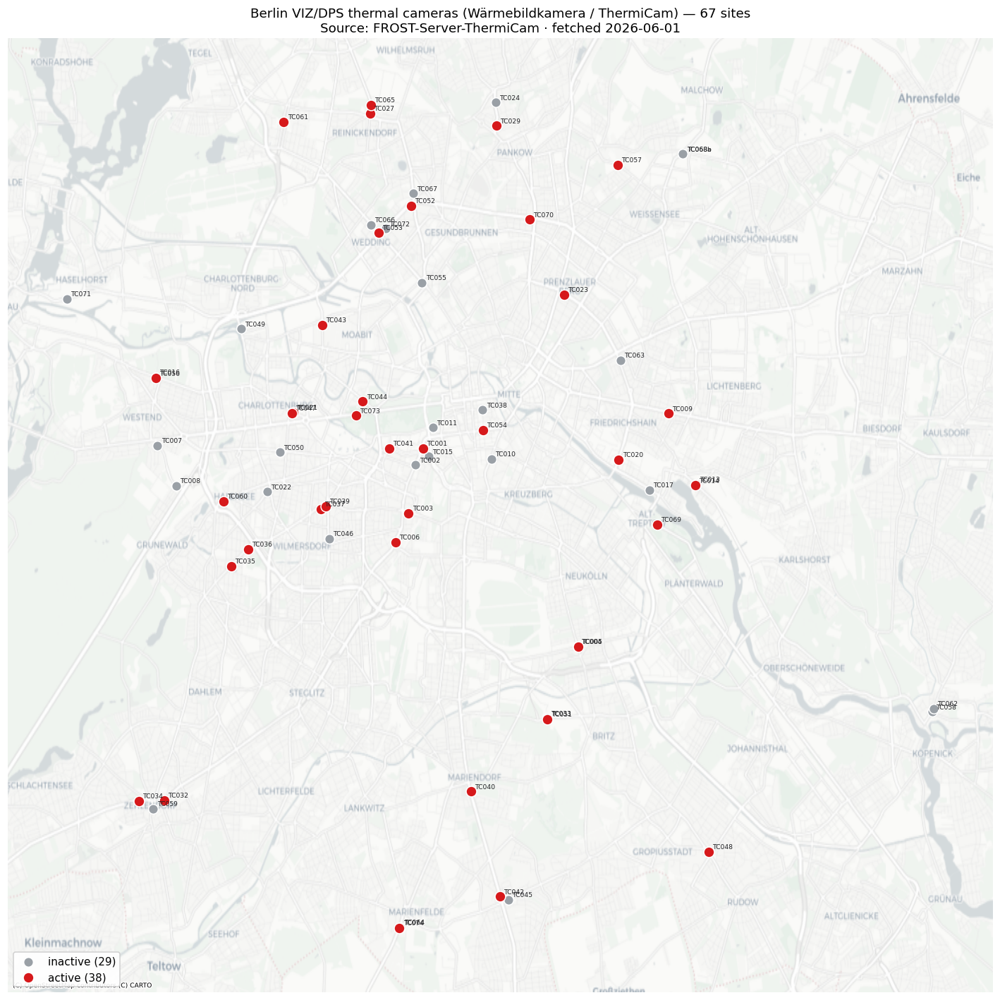

# Berlin thermal-camera (Wärmebildkamera / ThermiCam) positions & map

> 🤖 Agent-generated. Positions fetched live from `FROST-Server-ThermiCam` on
> **2026-06-01** (67 sites). Licence: dl-de/by-2.0, attribution
> *"Senatsverwaltung für Verkehr Berlin / Digitale Plattform Stadtverkehr Berlin"*.

The Berlin VIZ/DPS **Wärmebildkamera** layer (FLIR ThermiCam thermal-imaging
detectors) is **not a WMS layer** — it is an OGC **SensorThings (FROST)** feed that
the [Masterportal at viz.berlin.de](https://viz.berlin.de/) renders as the catalog
layer `id: thermiCam` (menu name *"Wärmebildkamera"*, dataset *"Verkehrsdetektion –
Wärmebildkamera (BETA)"*). This file pins every site's coordinates and renders them
on a map.

## Map



🔴 active (38) · ⚪ inactive (29) · basemap © OpenStreetMap contributors, © CARTO.

## How the positions were fetched

```bash
B="https://api.viz.berlin.de/FROST-Server-ThermiCam/v1.1"
curl -s "$B/Things?\$count=true&\$top=200\
&\$select=@iot.id,name,description,properties\
&\$expand=Locations(\$select=name,location)"
# -> 67 Things; each Location.location is GeoJSON Point [lon, lat] (EPSG:4326)
```

## Summary

- **67 camera sites** total — **38 active**, **29 inactive** (per each
  Thing's `properties.status`).
- Spread across Berlin, concentrated on the inner main-road network; eastern/southern
  arterials included. Each site carries `bezirk`, `ortsteil`, `plz`, `position`,
  `direction`, and a `lamppost` mast ID.
- Sites by borough (Bezirk):

- **Mitte** — 15
- **Charlottenburg-Wilmersdorf** — 15
- **Pankow** — 7
- **Tempelhof-Schöneberg** — 6
- **Neukölln** — 6
- **Friedrichshain-Kreuzberg** — 5
- **Reinickendorf** — 4
- **Steglitz-Zehlendorf** — 3
- **Treptow-Köpenick** — 3
- **Lichtenberg** — 2
- **Spandau** — 1

## All 67 positions

| Site | Position | Direction | Ortsteil | PLZ | Bezirk | Status | Lat | Lon |
| --- | --- | --- | --- | --- | --- | --- | --- | --- |
| TC001 | Potsdamer Strasse | Nord-Ost | Tiergarten | 10785 | Mitte | 🔴 active | 52.50712 | 13.36921 |
| TC002 | Potsdamer Strasse | Süd-West | Tiergarten | 10785 | Mitte | ⚪ inactive | 52.50374 | 13.36610 |
| TC003 | Goebenstraße | Ost | Schöneberg | 10783 | Tempelhof-Schöneberg | 🔴 active | 52.49385 | 13.36324 |
| TC004 | Hermannstraße | Süd | Neukölln | 12051 | Neukölln | ⚪ inactive | 52.46673 | 13.43161 |
| TC005 | Hermannstraße | Nord | Neukölln | 12051 | Neukölln | 🔴 active | 52.46676 | 13.43194 |
| TC006 | Hauptstraße | Nord | Schöneberg | 10827 | Tempelhof-Schöneberg | 🔴 active | 52.48803 | 13.35786 |
| TC007 | Jafféstraße | Nord-West | Westend | 14052 | Charlottenburg-Wilmersdorf | ⚪ inactive | 52.50771 | 13.26168 |
| TC008 | Jafféstraße | Süd-Ost | Westend | 14055 | Charlottenburg-Wilmersdorf | ⚪ inactive | 52.49947 | 13.26919 |
| TC009 | Frankfurter Allee | Ost | Friedrichshain | 10247 | Friedrichshain-Kreuzberg | 🔴 active | 52.51422 | 13.46841 |
| TC010 | Lindenstraße | Nord | Kreuzberg | 10969 | Friedrichshain-Kreuzberg | ⚪ inactive | 52.50494 | 13.39685 |
| TC011 | Lennestraße | Ost | Tiergarten | 10785 | Mitte | ⚪ inactive | 52.51133 | 13.37300 |
| TC013 | Hauptstraße | Nord-West | Rummelsburg | 10317 | Lichtenberg | 🔴 active | 52.49978 | 13.47938 |
| TC014 | Hauptstraße | Süd-Ost | Rummelsburg | 10317 | Lichtenberg | 🔴 active | 52.49955 | 13.47929 |
| TC015 | Reichpietschufer | West | Tiergarten | 10785 | Mitte | ⚪ inactive | 52.50543 | 13.37144 |
| TC016 | Spandauer Damm | West | Westend | 14050 | Charlottenburg-Wilmersdorf | ⚪ inactive | 52.52163 | 13.26089 |
| TC017 | Stralauer Allee | Süd-Ost | Friedrichshain | 10245 | Friedrichshain-Kreuzberg | ⚪ inactive | 52.49862 | 13.46061 |
| TC020 | Warschauer Straße | Süd | Friedrichshain | 10243 | Friedrichshain-Kreuzberg | 🔴 active | 52.50482 | 13.44825 |
| TC021 | Otto-Suhr-Allee | Nord-West | Charlottenburg | 10585 | Charlottenburg-Wilmersdorf | 🔴 active | 52.51439 | 13.31666 |
| TC022 | Paulsborner Str. | Süd-West | Wilmersdorf | 10709 | Charlottenburg-Wilmersdorf | ⚪ inactive | 52.49826 | 13.30616 |
| TC023 | Danziger Straße | Süd-Ost | Prenzlauer Berg | 10405 | Pankow | 🔴 active | 52.53837 | 13.42608 |
| TC024 | Grabbeallee | Süd | Niederschönhausen | 13156 | Pankow | ⚪ inactive | 52.57754 | 13.39849 |
| TC027 | Roedernallee | Süden | Reinickendorf | 13407 | Reinickendorf | 🔴 active | 52.57528 | 13.34761 |
| TC029 | Grabbeallee | Süden | Niederschönhausen | 13156 | Pankow | 🔴 active | 52.57278 | 13.39871 |
| TC032 | Berliner Straße | West | Zehlendorf | 14169 | Steglitz-Zehlendorf | 🔴 active | 52.43547 | 13.26430 |
| TC033 | Gradestraße | West | Britz | 12347 | Neukölln | ⚪ inactive | 52.45217 | 13.41933 |
| TC034 | Potsdamer Straße | Osten | Zehlendorf | 14163 | Steglitz-Zehlendorf | 🔴 active | 52.43532 | 13.25405 |
| TC035 | Hohenzollerndamm | Süd-West | Schmargendorf | 14199 | Charlottenburg-Wilmersdorf | 🔴 active | 52.48311 | 13.29139 |
| TC036 | Hohenzollerndamm | Nord-Ost | Schmargendorf | 14199 | Charlottenburg-Wilmersdorf | 🔴 active | 52.48658 | 13.29836 |
| TC037 | Hohenzollerndamm | Ost | Wilmersdorf | 10717 | Charlottenburg-Wilmersdorf | 🔴 active | 52.49473 | 13.32774 |
| TC038 | Französische Straße | Ost | Mitte | 10117 | Mitte | ⚪ inactive | 52.51495 | 13.39321 |
| TC039 | Hohenzollerndamm | Ost | Wilmersdorf | 10717 | Charlottenburg-Wilmersdorf | 🔴 active | 52.49537 | 13.32963 |
| TC040 | Mariendorfer Damm | Nord | Mariendorf | 12107 | Tempelhof-Schöneberg | 🔴 active | 52.43725 | 13.38842 |
| TC041 | Von-der-Heydt-Straße | West | Tiergarten | 10785 | Mitte | 🔴 active | 52.50712 | 13.35529 |
| TC042 | Mariendorfer Damm | Süd | Lichtenrade | 12107 | Tempelhof-Schöneberg | 🔴 active | 52.41586 | 13.40015 |
| TC043 | Beusselstraße | Süden | Moabit | 10553 | Mitte | 🔴 active | 52.53226 | 13.32840 |
| TC044 | Altonaer Straße | Süd-Ost | Tiergarten | 10557 | Mitte | 🔴 active | 52.51667 | 13.34470 |
| TC045 | Marienfelder Chaussee | West | Buckow | 12349 | Neukölln | ⚪ inactive | 52.41523 | 13.40354 |
| TC046 | Bundesallee | Norden | Wilmersdorf | 10717 | Charlottenburg-Wilmersdorf | ⚪ inactive | 52.48874 | 13.33124 |
| TC047 | Otto-Suhr-Allee | Süd-Ost | Charlottenburg | 10585 | Charlottenburg-Wilmersdorf | 🔴 active | 52.51426 | 13.31592 |
| TC048 | Neuköllner Straße | Nord-West | Rudow | 12357 | Neukölln | 🔴 active | 52.42498 | 13.48457 |
| TC049 | Tegeler Weg | Nord | Charlottenburg-Nord | 10589 | Charlottenburg-Wilmersdorf | ⚪ inactive | 52.53146 | 13.29560 |
| TC050 | Kantstraße | Ost | Charlottenburg | 10625 | Charlottenburg-Wilmersdorf | ⚪ inactive | 52.50632 | 13.31120 |
| TC051 | Gradestraße | Ost | Britz | 12347 | Neukölln | 🔴 active | 52.45197 | 13.41945 |
| TC052 | Seestraße | Nord-Ost | Wedding | 13347 | Mitte | 🔴 active | 52.55650 | 13.36413 |
| TC053 | Müllerstraße | Nord-West | Wedding | 13349 | Mitte | 🔴 active | 52.55107 | 13.35118 |
| TC054 | Leipziger Straße | Ost | Mitte | 10117 | Mitte | 🔴 active | 52.51086 | 13.39339 |
| TC055 | Müllerstraße | Süd-Ost | Wedding | 13353 | Mitte | ⚪ inactive | 52.54084 | 13.36866 |
| TC056 | Spandauer Damm | Ost | Westend | 14050 | Charlottenburg-Wilmersdorf | 🔴 active | 52.52138 | 13.26086 |
| TC057 | Romain-Rolland-Straße | West | Heinersdorf | 13089 | Pankow | 🔴 active | 52.56480 | 13.44789 |
| TC058 | Bahnhofstraße | Nord-Ost | Köpenick | 12555 | Treptow-Köpenick | ⚪ inactive | 52.45350 | 13.57520 |
| TC059 | Teltower Damm | Nord | Zehlendorf | 14169 | Steglitz-Zehlendorf | ⚪ inactive | 52.43373 | 13.25996 |
| TC060 | Kurfürstendamm | Nord-West | Halensee | 10711 | Charlottenburg-Wilmersdorf | 🔴 active | 52.49629 | 13.28830 |
| TC061 | Antonienstraße | Süd | Reinickendorf | 13403 | Reinickendorf | 🔴 active | 52.57358 | 13.31274 |
| TC062 | Bahnhofstraße | Süd | Köpenick | 12555 | Treptow-Köpenick | ⚪ inactive | 52.45410 | 13.57560 |
| TC063 | Petersburger Straße | Nord | Friedrichshain | 10249 | Friedrichshain-Kreuzberg | ⚪ inactive | 52.52503 | 13.44891 |
| TC064 | Marienfelder Allee | Nord | Marienfelde | 12279 | Tempelhof-Schöneberg | ⚪ inactive | 52.40960 | 13.35989 |
| TC065 | Roedernallee | Nord | Reinickendorf | 13407 | Reinickendorf | 🔴 active | 52.57701 | 13.34808 |
| TC066 | Müllerstraße | Süd-Ost | Wedding | 13349 | Mitte | ⚪ inactive | 52.55265 | 13.34788 |
| TC067 | Markstraße | Süden | Reinickendorf |  | Reinickendorf | ⚪ inactive | 52.55900 | 13.36500 |
| TC068a | Malchower Chaussee | Süd-West |  | 13088 | Pankow | ⚪ inactive | 52.56705 | 13.47423 |
| TC068b | Malchower Chaussee | Nord-Ost |  | 13088 | Pankow | ⚪ inactive | 52.56705 | 13.47423 |
| TC069 | Puschkinallee | Nord-West | Alt-Treptow | 12435 | Treptow-Köpenick | 🔴 active | 52.49156 | 13.46378 |
| TC070 | Bornholmer Straße | Ost | Prenzlauer Berg | 10439 | Pankow | 🔴 active | 52.55370 | 13.41208 |
| TC071 | Am Juliusturm | West | Haselhorst | 13599 | Spandau | ⚪ inactive | 52.53757 | 13.22510 |
| TC072 | Seestraße | Süd-West | Wedding | 13347 | Mitte | ⚪ inactive | 52.55181 | 13.35409 |
| TC073 | Straße des 17. Juni | Ost | Tiergarten | 10557 | Mitte | 🔴 active | 52.51376 | 13.34194 |
| TC074 | Marienfelder Allee | Süd | Marienfelde | 12279 | Tempelhof-Schöneberg | 🔴 active | 52.40948 | 13.35953 |
