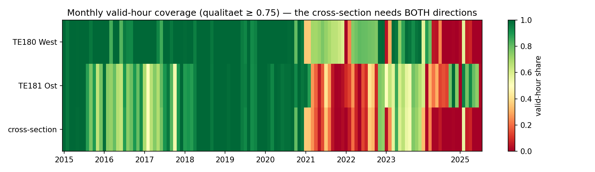
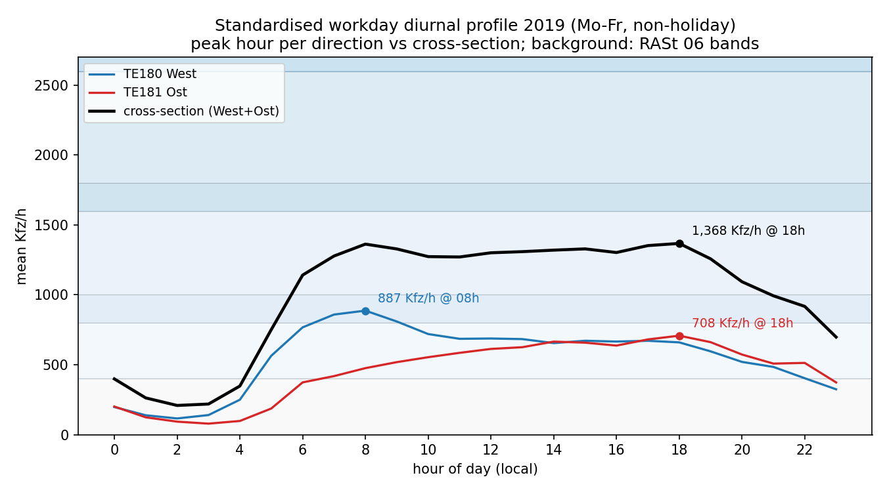
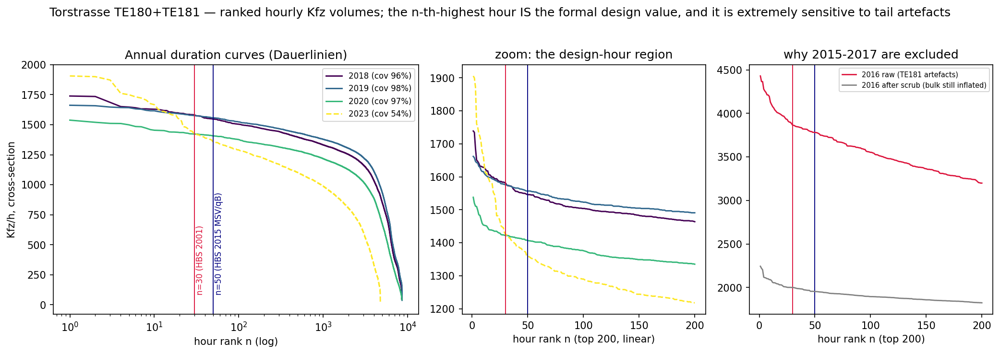
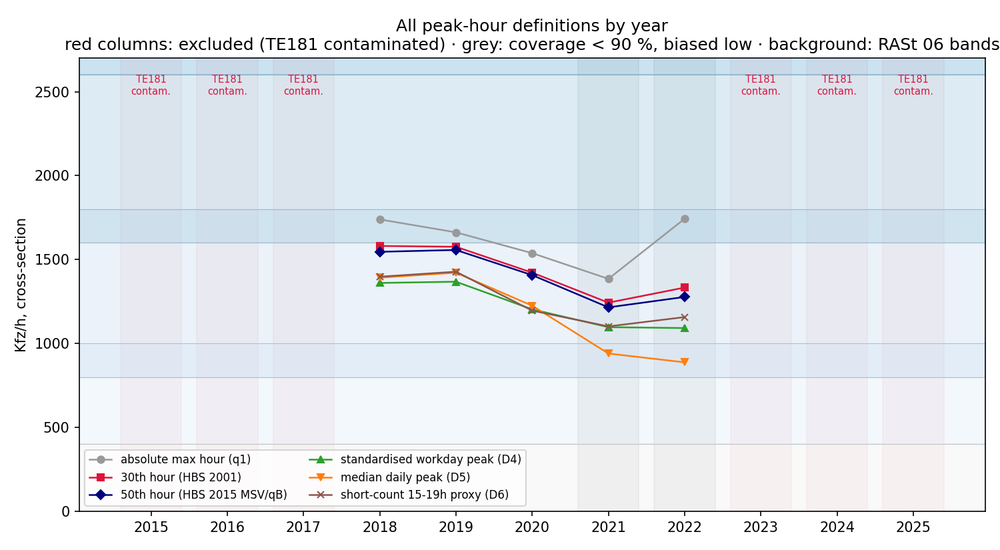
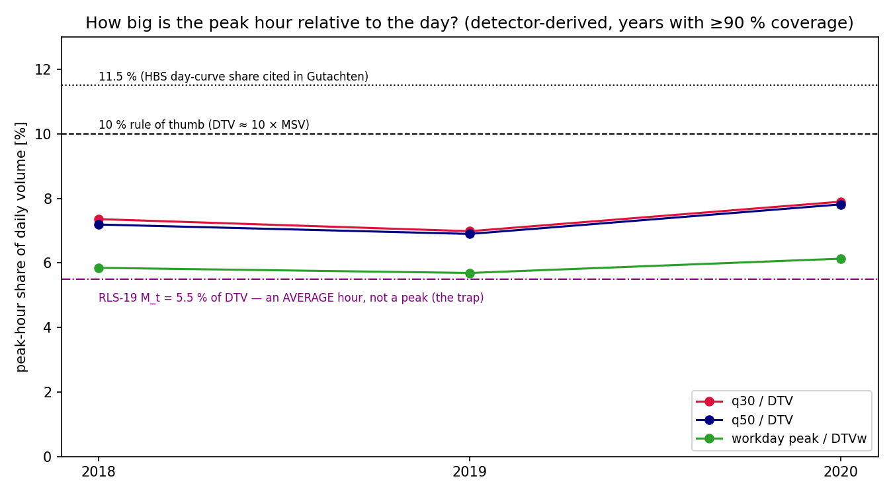
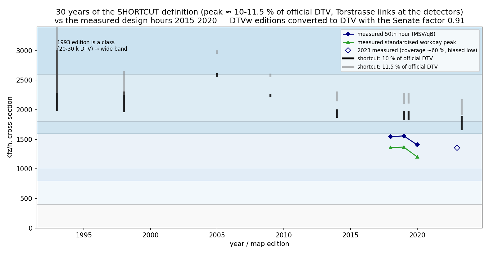
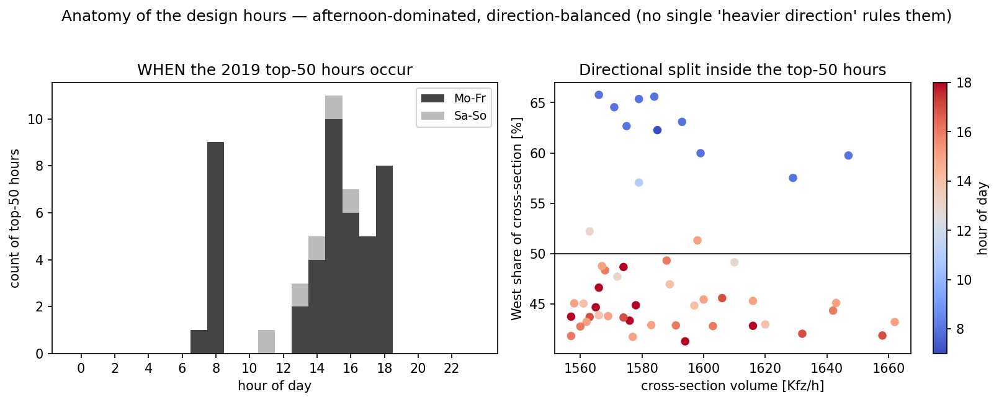
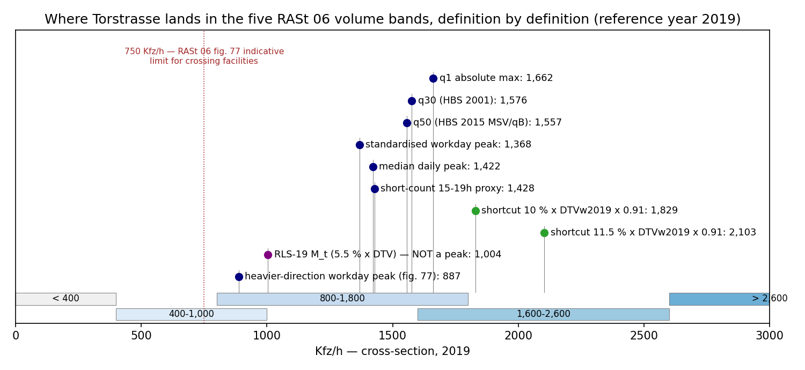

# Torstraße peak hour — every definition of "Spitzenstunde", computed

> 🤖 Generated by a coding agent — not human-verified. Detector data: Berlin
> Verkehrsdetektion open archive (hourly Messquerschnitt values, alte
> Qualitätssicherung, 2015-2024), dl-de/by-2.0, attribution *"Digitale
> Plattform Stadtverkehr Berlin / Verkehrsdetektion Berlin"*. Official daily
> volumes: Geoportal/FIS-Broker WFS (Umweltatlas DTV 1993-2019,
> Verkehrsmengenkarte DTVw 2019/2023). **Raw hourly data is not committed**
> (re-fetch with `fetch.py`); the small derived tables, figures and code are.

## Executive summary

The companion regulatory note
[`city-development-regulations/02-rast06-peak-hour-kfz-h`](../../city-development-regulations/02-rast06-peak-hour-kfz-h.md)
established that RASt 06 uses "peak-hour Kfz/h at the cross-section" without
defining how to measure it, and that at least **nine operationalisations**
circulate (n-th-highest hour, standardised counts, DTV shortcuts, …). Here we
compute **all of them on one real street**: Torstraße (Berlin-Mitte), using
the **TE180 (West) + TE181 (Ost)** lane-detector cross-sections as a synthetic
RASt cross-section, hourly 2015 → mid-2025 (blob archive + the frozen TEU
SensorThings tail), plus **30 years of official DTV/DTVw map editions
(1993-2023)** for the shortcut definitions.

For the reference year **2019** (98 % coverage, pre-COVID, both directions
clean), every *measured* definition lands in a tight cluster:

| # | Definition | Regulatory home | 2019 value [Kfz/h] | RASt 06 band |
|---|------------|-----------------|--------------------:|--------------|
| D1 | absolute max hour (q1) | none — event-driven | 1,662 | 800-1,800 (overlap zone) |
| D2 | 30th-highest hour of the year | HBS 2001 MSV | 1,576 | 800-1,800 |
| D3 | **50th-highest hour** of the year | **HBS 2015 MSV / q_B (ARS 14/2015)** | **1,557** | 800-1,800 |
| D4 | standardised workday peak (mean Mo-Fr diurnal max) | what a count/Gutachten reports into RASt 5.1.1 | 1,368 @ 18 h | 800-1,800 |
| D5 | median daily peak hour | descriptive | 1,422 | 800-1,800 |
| D6 | short-count proxy (Tue/Thu 15-19 h max) | municipal counting practice | 1,428 | 800-1,800 |
| D7 | **shortcut: 10 % / 11.5 % of DTV** | Wikipedia heuristic / HBS day-curve share | **1,829 / 2,103** | **1,600-2,600 — one band high!** |
| D8 | RLS-19 M_t = 5.5 % × DTV | noise assessment — an *average* hour, **not** a peak | 1,004 | (n/a) |
| D9 | heavier-direction workday peak | RASt 06 fig. 77 (crossing facilities) | 887 @ 08 h (West) | above the 750 indicative limit |

> **Key insight:** on Torstraße the *measured* peak hour is **6.9-7.0 % of
> DTV** (q50/DTV; 5.7 % for the workday-profile peak vs DTVw) — nowhere near
> the 10-11.5 % textbook shares. The **shortcut definition (D7) overshoots by
> ~20-50 % and misplaces the street one full RASt 06 band higher**
> (1,600-2,600 instead of 800-1,800). BASt's verdict that the
> DTV-percentage method is *"sehr ungenau"* is not an abstract warning — on a
> flat-profiled inner-city street it changes the design conclusion. Meanwhile
> the difference between the 30th and the 50th hour is **1.2 %** (1,576 vs
> 1,557) — the *formal* definition switch of 2015 is immaterial here, exactly
> as BASt found.

## Site, data, and the cross-section construction

| | |
|---|---|
| Directional MQs | `TE180` Torstraße Haus 199, **Richtung West** (2 lanes) · `TE181` Haus 178, **Richtung Ost** (2 lanes) — ~170 m apart, two side streets in between |
| Source | blob archive `…/alte_qualitaetssicherung/Messquerschnitte/mq_hr_YYYY_MM.csv.gz`, hourly, local time; validity gate `qualitaet ≥ 0.75` (archive convention) — extended past 2024-12 with the **frozen TEU SensorThings (FROST) hourly MQ streams** (`fetch_frost.py`; un-QA'd, only for slots the archive never covered) |
| Cross-section rule | `cross = west + ost`, **only for hours where both directions are valid** — RASt 06's default reference is the both-directions cross-section |
| Window | 2015-01 → 2025-07 (TE180's last observation 2025-04-13, TE181's 2025-07-02 — the TEU network is being decommissioned, so this is the **end of the series**); **usable for year metrics: 2018, 2019, 2020** (see below) |
| Vehicle class | `q_kfz` (all motor vehicles) — RASt-faithful, unlike the PKW-only [`te180-deepdive`](../te180-deepdive/) |

Three data-quality interventions, all visible in the figures:

1. **Plausibility scrub.** Directional hours > 1,300 Kfz/h are sensor
   artefacts (clean-period envelope max ≈ 1,230): the flagged hours show
   3,400-4,100 Kfz/h at 8-12 km/h crawl speeds — including 3,835 Kfz/h at
   **4 a.m.** Also scrubbed: directional hours of exactly **0 Kfz/h** — the
   2018-2020 floor is 3-5 Kfz/h (never zero), and the QA in
   [`frost-qa.md`](frost-qa.md) § 4 shows hourly zeros are dying lane heads
   reporting false zeros, not empty streets (validated against the
   blocked-lane alternative). Both are set to missing (counts per year in
   `summary.json`); the headline years 2018-2020 contain neither.
2. **Marathon Sundays excluded.** The BMW Berlin-Marathon course runs
   **along Torstraße** (Reinhardtstr. → Torstraße → Karl-Marx-Allee, ~km 7).
   On race Sundays the closed street's infrared detectors **count the
   runners**: a near-zero closure hour (e.g. 26 Kfz at 08 h on 2018-09-16),
   then 1,000-2,400 "Kfz/h" from ~09:30 as the field passes — at runner-pace
   "speeds" of 3-10 km/h, or with absurd 69-84 km/h misreads. The signature
   recurs on **every** race Sunday 2015-2023 in the data, so all marathon
   dates are dropped wholesale (2020 was cancelled). Without this, 2018's
   "annual maximum" would be 2,275 runner-counted Kfz/h.
3. **2015-2017 excluded as contaminated.** TE181's *bulk* is inflated in
   those years (6.5-14.8 % of hours above 1,300; median 15-h-hour 2016: 903
   vs ~640 in clean years) — no scrub can repair an inflated bulk, so these
   years carry no cross-section metrics. 2021-2025 fail on **coverage**
   instead (TE181 ≤ 28 % valid hours from 2021; TE180 dies April 2025).



## The definitions, walked through

### D4/D9 — the standardised workday peak, per direction and cross-section



The 2019 workday profile shows why "which sensor" and "which reference"
matter. The directions peak **in opposite rush hours** — West 887 Kfz/h at
08 h (into the centre), Ost 708 Kfz/h at 18 h — and the cross-section sum is
a **flat plateau from 08 h to 18 h** (≈1,270-1,370 Kfz/h) whose nominal
maximum (1,368 @ 18 h) barely exceeds its 08-h shoulder; across years the
peak position flip-flops between 08 h and 18 h while the *value* stays
stable. Three consequences:

- the cross-section peak hour is **not** "heavier direction × 2" (that would
  give 1,774) nor "2 × half" — the directional asymmetry averages out;
- RASt 06 fig. 77 (crossing facilities) explicitly wants the **heavier
  direction** (887 Kfz/h) — clearly above fig. 77's 750 Kfz/h indicative
  limit, consistent with Torstraße's actual median refuge islands;
- the **short-count proxy D6** (Tue/Thu 15-19 h window) lands within 0.5 % of
  the median daily peak (D5) here — the standard afternoon counting window is
  representative *for this street* because of the plateau, **not** as a
  general rule (a purely AM-peaked street would be undercounted).

### D1-D3 — the duration curve and the n-th-highest hour



Ranking all ~8,760 hourly values of a year (Dauerlinie) gives the formal
design values: **q30 (HBS 2001)** and **q50 (HBS 2015's MSV/q_B per
ARS 14/2015)**. The curve is so flat in the design region that q30 → q50
loses only 1.2-2.3 % (2018-2020) — and even q1 → q50 only ~6 % in 2019. The
third panel shows why 2015-2017 had to go: the contaminated TE181 tail bends
the whole design region upward (raw 2016 "q30" ≈ 3,900; after scrub still
≈ 2,000 from the inflated bulk, vs ≈ 1,580 in clean years) — **the
n-th-hour metric is maximally exposed to tail artefacts**, far more than any
mean-based definition.

The flat top has a second consequence: missing-data bias is tiny. With ≥ 97 %
coverage, the coverage-proportional rank correction (`q50_adj`) changes
nothing (1,557 → 1,557 in 2019).

**q1 is noise-dominated, which is exactly why the formal definitions skip
it:** before the marathon exclusion, 2018's apparent annual maximum
(2,275 Kfz/h, +44 % over q30) was **Sunday 16 Sep 2018, 10:00 — the detector
counting the Berlin-Marathon field running down the closed street** (the race
passes Torstraße at ~km 7). With marathon Sundays removed, every year's q1
drops to within ~6-10 % of q30 (2018: 1,739, an ordinary pre-Christmas Friday
afternoon) — the absolute maximum of a *valid* year carries no information the
30th hour doesn't.



### D7/D8 — the shortcut definitions against measured truth



The detector data yields both sides of the ratio: measured q30/q50 over
detector-derived DTV gives **6.9-7.9 %** (2018-2020), the workday-profile
peak over DTVw gives **5.7-6.1 %**. Both textbook shares (10 %, 11.5 %)
overshoot massively; the RLS-19 daytime *average* hour (5.5 % × DTV — the
"M-value trap" from the regulatory note) is, on this flat-profiled street,
**almost equal to the real workday peak share** — a coincidence of profile
flatness, but a vivid illustration that an inner-city day-curve is nothing
like the commuter-route shape the 10 % rule implies.

### D7 over 30 years — the official DTV/DTVw record 1993-2023



All retrievable official editions for the links at the detectors
(Geoportal WFS; DTVw converted to DTV with the Senate factor 0.91):

| Edition | Product | DTV-equivalent [Kfz/24h], link range |
|---------|---------|--------------------------------------|
| 1993 | Umweltatlas DTV (classed) | 20,001-30,000 |
| 1998 | Umweltatlas DTV | 19,576-23,084 |
| 2005 | Umweltatlas DTV | 25,744-26,016 — the corridor's peak |
| 2009 | Umweltatlas DTV | 22,430 |
| 2014 | Umweltatlas DTV | 18,630-20,070 |
| 2019 | Umweltatlas DTV · native DTVw | 18,260-19,800 · 18,291-19,838 (DTVw 20,100-21,800) |
| 2023 | native DTVw | 16,562-18,928 (DTVw 18,200-20,800) |

Two readings: (a) corridor daily volume is down **~30 % from its 2005 peak**;
(b) the shortcut band (10-11.5 % of DTV) sat at 2,000-3,000 Kfz/h for most of
those 30 years — implying the 1,600-2,600 RASt band, even grazing > 2,600 in
2005 — while the **measured** design hours (2018-2020: 1,407-1,583) never
left 800-1,800. *The two definitions of "peak hour" disagree about the
street's regulatory placement across the entire historical record.* (Caveat:
editions are balanced products on changing count networks; the Senate warns
against direct cross-edition comparison — used here as context, not as a
trend measurement.)

### Anatomy of the design hours



2019's top-50 hours (the q30/q50 neighbourhood): **afternoon-dominated
(13-18 h) with an 08-h minority**, almost all workdays. The directional split
inside them is 42-65 % West — morning entries are West-heavy (blue, ~60-65 %),
afternoon entries lean Ost (~55-58 % Ost) — confirming that the design hours
are *cross-section* phenomena, not one direction's rush. Lkw share within the
top-50: **5.6-6.4 %** — incidentally at RASt 06's "6 % heavy traffic"
reference for mixed-traffic thresholds.

### Where Torstraße lands, definition by definition



All measured definitions agree on **RASt band 800-1,800** (q30/q50 graze the
1,600 overlap edge from below; q1 sits inside the 1,600-1,800 overlap zone —
the band overlap absorbs exactly this kind of definitional spread). Only the
DTV shortcuts jump the fence into 1,600-2,600.

## Limitations

- **The synthetic cross-section is an approximation**: TE180 and TE181 are
  ~170 m apart with Tucholskystraße and Kleine Hamburger Straße in between —
  not a literal single Querschnitt. Relatedly, detector-derived DTVw
  (2019: 24,037) exceeds the map DTVw (20,100-21,800) by **~10-19 %**;
  map balancing, link aggregation, side-street effects and possible detector
  overcount are all candidates — unresolved, so detector-internal ratios
  (D-shares) are computed detector-consistent, and map-based shortcuts
  map-consistent.
- The MQs cover the main carriageway lanes (HF1/HF2) per direction; TEU
  infrared classification of Lkw is approximate, two-wheelers unreliable.
- 2015-2017 (TE181 bulk contamination) and 2021-2025 (coverage collapse;
  TE181 ≤ 28 %, TE180 dead from April 2025) carry no headline metrics. 2020
  is a COVID year — shown, but atypical (everything ~12 % below 2019).
- **The 2024-11 → 2025-07 tail from the FROST SensorThings API is un-QA'd
  and, per the dedicated QA in [`frost-qa.md`](frost-qa.md), effectively
  invalid**: FROST's "Messquerschnitt" rollup silently degrades to a
  single-lane sum (total for TE181 from 2024-12), so the 2025 row should be
  read as invalid, not merely low-coverage. It is also the series' end:
  Torstraße has no live successor detector (no ThermiCam site).
- Other street-closing events (half-marathon, demonstrations, roadworks) are
  *not* systematically excluded — only the marathon's runner-count signature
  was identified and removed. Residual event noise remains in q1.
- The archive's historical data was reworked in 2025; numbers may differ from
  older pulls. Berlin holiday calendar (incl. one-offs 2017-10-31, 2020-05-08
  and Frauentag from 2019) is implemented in `analyze.py`.
- n-th-hour values are computed on observed hours (no infill); at ≥ 97 %
  coverage the rank-corrected values differ by ≤ 0.2 %.

## Reproduce

```bash
cd berlin-traffic-groundwork/torstrasse-peak-hour
python3 fetch.py        # 120 monthly MQ bundles, sequential + cached (~8 min)
python3 fetch_frost.py  # un-QA'd 2024-11..2025-07 tail from the FROST API
python3 fetch_dtv.py    # 8 WFS queries for the 1993-2023 editions
python3 analyze.py      # pure function of the cached CSVs -> figures + summary.json
```

Both fetchers are idempotent, sequential and paced (see
[`../../AGENTS.md`](../../AGENTS.md) → *Be a good citizen*); `analyze.py`
needs no network.

## Sources

- Detector archive: [DPS — Verkehrsdetektion](https://api.viz.berlin.de/daten/verkehrsdetektion)
  (blob container `verkehrsdetektion`, alte QS Messquerschnitte) ·
  [open-data record](https://daten.berlin.de/datensaetze/verkehrsdetektion-berlin)
- Latest tail: TEU SensorThings `https://api.viz.berlin.de/FROST-Server-TEU/v1.1`
  — Things(80)/(81) = TE180/TE181, hourly MQ datastreams
  ("Anzahl/Geschwindigkeit KFZ Stunde - Messquerschnitt", ids 8714/8720/8738
  and 8822/8828/8846)
- Marathon course along Torstraße: [BMW Berlin-Marathon — course](https://www.bmw-berlin-marathon.com/en/your-race/course) ·
  [Tagesspiegel — Strecke und Sperrungen 2018](https://www.tagesspiegel.de/berlin/strecke-und-sperrungen-des-berlin-marathons-2018-5532010.html)
- Official volumes (WFS, gdi.berlin.de): `ua_verkehrsmengen_{1993,1998,2005,2009,2014,2019}` ·
  `verkehrsmengen_2019:dtvw2019kfz` · `verkehrsmengen_2023:dtvw2023kfz`
- DTVw→DTV factor 0.91 & RLS-19 M-values: [SenUMVK, Hinweise und Faktoren zur Umrechnung von Verkehrsmengen, 04/2022 (PDF)](https://www.berlin.de/sen/uvk/_assets/verkehr/verkehrsdaten/umrechungsfaktoren-von-verkehrsmengen/hinweise-und-faktoren-zur-umrechnung-von-verkehrsmengen.pdf)
- Definitions & regulatory homes: [`../../city-development-regulations/02-rast06-peak-hour-kfz-h.md`](../../city-development-regulations/02-rast06-peak-hour-kfz-h.md)
  (RASt 06 § 5.1.1, fig. 77; ARS 14/2015 50th hour; BASt Foko 02/2018)
- Companions: [`../te180-deepdive/`](../te180-deepdive/) (5-min PKW study, same West MQ) ·
  [`../teu-detectors-viz-api/`](../teu-detectors-viz-api/) (API anatomy, the 8 Torstraße detectors) ·
  [`../dtv-dtvw-reference.md`](../dtv-dtvw-reference.md) (DTV/DTVw semantics)

**Research date:** 2026-06-11.
