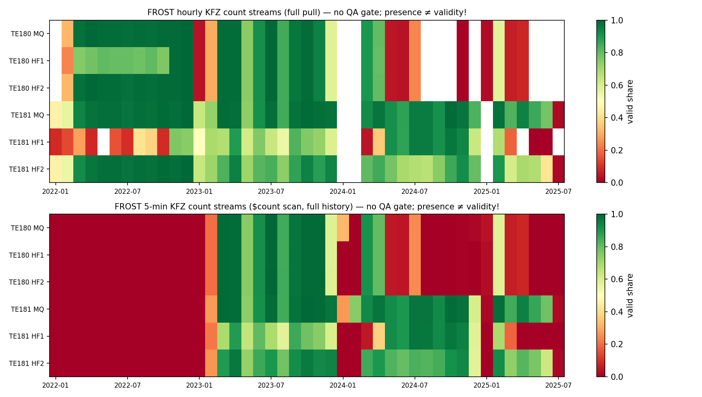
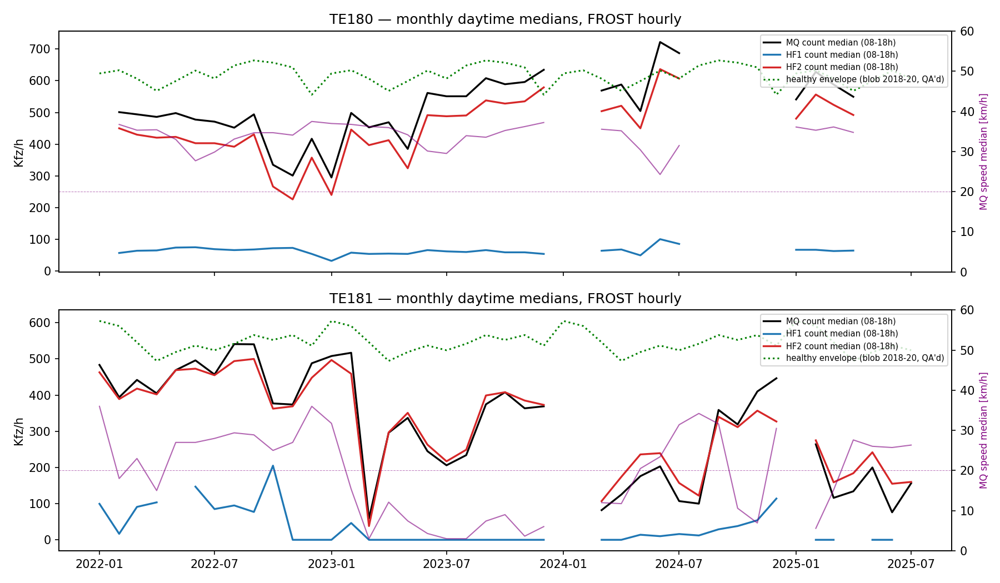
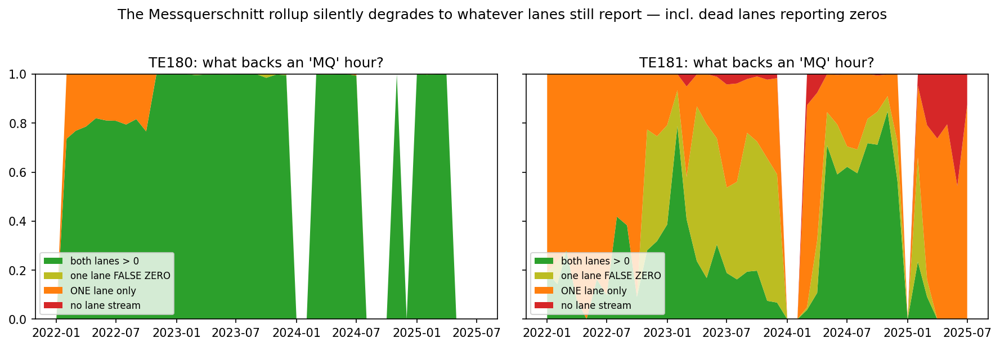
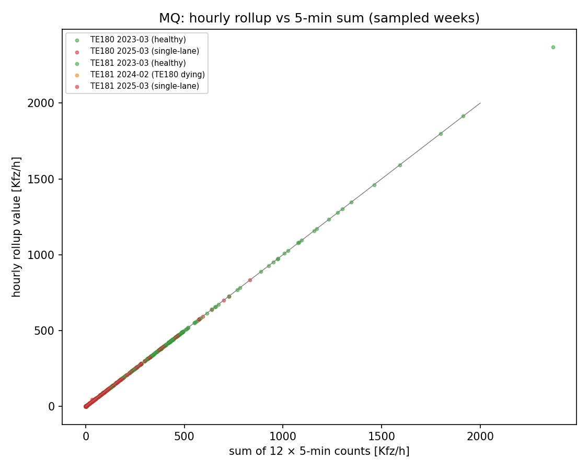

# QA: the TEU FROST (SensorThings) data for Torstraße — what is usable, what is not

> 🤖 Generated by a coding agent — not human-verified. Companion to
> [`README.md`](README.md) (the peak-hour study) and the
> [`te180-deepdive`](../te180-deepdive/). Data: legacy TEU SensorThings
> server `FROST-Server-TEU` (dl-de/by-2.0, attribution *"Digitale Plattform
> Stadtverkehr Berlin / Verkehrsdetektion Berlin"*); QA'd reference: the blob
> archive (alte Qualitätssicherung). Raw QA caches are git-ignored
> (`fetch_frost_qa.py` rebuilds them); `data/qa_summary.json` holds the stats.

## Executive summary

The peak-hour study's FROST tail (2024-11 → 2025-07) produced implausibly low
values, while the te180-deepdive's FROST year (2023) had been clean — this QA
resolves the paradox and maps **which FROST streams are usable in which
period**, for **single lanes and cross-section (Messquerschnitt), at 5-min
and hourly resolution**. Method: full pulls of all six hourly KFZ count
streams + speeds, an exhaustive `$count=true` scan of the full 5-min history,
sampled one-week 5-min windows in each network regime for value-level checks,
and an hour-by-hour cross-check against the QA'd blob archive
(`qa_frost.py`; all numbers in `data/qa_summary.json`).

> **Key insight — the "Messquerschnitt" lie:** FROST's cross-section rollup
> is simply **the sum of whatever lane detectors happened to report that
> hour**, with no flag when half the cross-section is missing — and "report"
> includes **lanes reporting zeros**. Verified exactly: when both lanes
> report, MQ = HF1+HF2 in 100.0 % of hours; when one lane reports, MQ equals
> that single lane; and in **41.6 % of TE181's "both-lane" hours one lane is
> exactly 0 beside a busy lane** — a zero the sum-identity check cannot
> interrogate. Counting those, **two-thirds (66.7 %) of TE181's 25,718
> "cross-section" hours rest on a single lane**, and 4 % are backed by no
> lane stream at all. Whether such an hour is *valid* depends on which lane
> and when: the right lane's zeros are largely **structural** (a
> quasi-parking lane; § 4 post-script), the through-lane's are **sensor
> pathology**. A FROST MQ value is only interpretable *together with* its
> lane streams.

## Why the 2025 tail looked bad while the deepdive looked promising

Four facts, all verified below — none of them is "the API is broken":

1. **Different period = different sensor health.** The deepdive's dense year
   (TE180, 5-min, 2023-02 → 2024-01) is the network's last healthy stretch.
   The peak-hour tail pull starts 2024-11 — ten months *after* TE180 went
   `n.o.k.` and into TE181's terminal decay. Same API, opposite ends of the
   sensors' life.
2. **FROST has no QA layer; the blob archive does.** The alte-QS pipeline
   drops hours below 75 % interval-validity and requires *all* member lanes
   for a cross-section value. FROST serves raw rollups — including
   single-lane "cross-sections" and partial hours.
3. **The surviving hardware was itself failing.** TE181's right lane (HF1)
   undercounts massively through the *whole* FROST era and dies repeatedly;
   its left lane decays from late 2024. Low values are sensor rot, not
   traffic.
4. **FROST holds no deep history**: the hourly streams begin 2022-01
   (TE181) / 2022-02 (TE180), and the 5-min streams a year later still
   (~2023-01) — the deepdive's "stream starts 2023-02-22" is a property of
   the 5-min stream, not the sensor. Everything from the good years
   2015-2020 exists only in the blob archive — FROST's unique contribution
   is precisely the decommissioning-era tail.

## What was pulled (method)

| Material | Scope | Why this scope |
|---|---|---|
| Hourly KFZ counts, MQ + HF1 + HF2, both Things | **full history** (2022-01 → stream end) | the design-hour analysis runs on hourly Kfz; full pull is ~16-26 k obs/stream — affordable |
| Hourly KFZ speeds (MQ both; TE181 lanes) | full history | speed-collapse is the artefact signature |
| 5-min KFZ counts, MQ + lanes | **monthly `$count=true` scan over the full history** + **four sampled one-week windows** (2022-06, 2023-03, 2024-02, 2025-03 — one per regime) | a full 5-min pull would be ~4 M observations / thousands of paged requests against a public server for almost no extra information: the count-scan gives *exhaustive coverage* cheaply, and the windows give value-level checks in every regime; the windows then *prove* hourly = Σ(5-min), making a full pull redundant (§5) |
| QA'd blob archive (already cached) | 2022-01 → 2024-12 overlap | ground truth for the cross-check |

All fetching is sequential and paced (~0.45 s between page requests,
exponential backoff) per [`AGENTS.md`](../../AGENTS.md).

## Findings

### 1 · Coverage — and it differs *between aggregations of the same stream*



- **TE180** (all levels): solid 2022-02 → 2024-01, then effectively dark
  (isolated months at ≤ 25 %) until the stream ends 2025-04-13.
- **TE181 MQ**: high *presence* throughout (~85 %) — which is exactly the
  trap, because presence ≠ validity (see §3, §4).
- **TE181 HF1**: present only ~47 % of hours, with month-long holes — the
  sick lane.
- **Hourly and 5-min rollups of the same detector have independent
  coverage** — to the point of disjoint existence periods: the **5-min
  streams only begin ~2023-01** (all of 2022 exists solely as hourly), while
  TE181's *hourly* MQ stream is completely dark 2024-01 → 2024-02 with its
  *5-min* stream running at 97 % (sampled window). Never infer one
  aggregation's availability from the other.

### 2 · Value health — the sensors, not the street



Monthly daytime (08-18 h) medians against the QA'd 2018-2020 "healthy
envelope" (green dotted):

- **TE180 is value-sane to the very end**: even its sparse 2024-11 → 2025-04
  gasps sit at ~550-630 Kfz/h @ ~35 km/h — normal levels, just few of them.
  TE180's problem is *availability*, not *validity*.
- **TE181 decays in value**: ~500-600 (2022) → oscillating (2023-24) → < 200
  (2025), with MQ speed medians repeatedly below 20 km/h (crawl-speed
  misreads) from 2023 on. TE181's problem is *validity*, increasingly plus
  availability.
- **TE181 HF1 undercounts through the entire FROST era**: daytime medians of
  ~50-100 Kfz/h on a lane that should carry ~250-300. So even TE181's
  "both-lanes" hours under-report the direction — consistent with the QA'd
  blob's own decline of TE181 medians from 2021 (the street did not lose
  half its traffic; the detector did).

### 3 · The cross-section rollup defect



| | MQ hours | both lanes > 0 | both present, **one = false zero** | ONE lane | no lane stream | **effectively single-lane** |
|---|---:|---:|---:|---:|---:|---:|
| TE180 | 16,277 | 92.3 % | 0.1 % | 7.6 % | 0 % | 7.7 % |
| TE181 | 25,718 | 29.4 % | **20.9 %** | **45.7 %** | **4.0 %** | **66.7 %** |

The rollup is an exact lane sum (MQ = HF1+HF2 in 100.0 % of both-lane hours;
MQ = the lone lane when only one reports) — and exactly that: no completeness
requirement, no flag, and **a dead lane contributing 0 still counts as
"reporting"**, which the sum identity cannot distinguish from a real zero.
TE181's effective single-lane share is episodic in 2022-2024 and **total
from ~2024-12** (HF1: 469 → 456 → 134 → 1 valid hours/month). A consumer who
reads `Anzahl KFZ Stunde - Messquerschnitt` without joining the lane streams
cannot tell a 600-Kfz/h cross-section from a 600-Kfz/h half-cross-section.

### 4 · Do zeros mean "no cars"? At hourly level: never

The QA'd 2018-2020 reference years set the physical floor: over three years
and two directions the **minimum hourly value is 3-5 Kfz/h** (p1 ≈ 44-56),
with **not a single zero** — an hourly zero on Torstraße does not occur in
reality. At **5-min** granularity, isolated overnight zeros *are* plausible
(the te180-deepdive found 46 scattered deep-night zero slots in TE180's
healthy year — true lulls).

Against that floor, the FROST hourly count streams contain wholesale zeros,
mostly in **daytime**:

| stream | zero hours | of them daytime (6-22 h) | concentration |
|---|---:|---:|---|
| TE180 MQ / HF2 | 0 / 0 | — | clean |
| TE180 HF1 | 23 | 17 | scattered |
| TE181 MQ | 569 | 355 | 2023-2025 |
| TE181 HF1 | **7,204** | **4,925** | the dead lane: half its "valid" hours |
| TE181 HF2 | 638 | 404 | 2023-2025 |

These are **false zeros** — a failing detector head reporting 0 while
traffic flows (the parallel lane carries hundreds). Three consequences:

- **"Present-but-zero" is the more dangerous failure mode.** The deepdive's
  device-class rule ("TEU goes silent rather than reporting zeros") holds
  for a *healthy-but-interrupted* TEU sensor (TE180, 2023); a *dying* TEU
  lane does the opposite — it keeps "reporting" zeros for years. Absence of
  data still means sensor trouble; presence of a zero (or near-zero) at
  hourly level means sensor trouble **too**.
- **The hourly rollup fabricates values over incomplete input.** In the
  sampled windows, hours with only 1-11 of 12 five-min slots still receive
  hourly values (TE180: 4 of 4; TE181: 24 of 43) — sometimes the bare
  partial sum (TE181: a 9-slot, all-zero hour rolled up to `hourly = 0`),
  sometimes more than the visible 5-min sum. An un-QA'd hourly value
  guarantees neither a complete hour nor live lanes behind it.
- **The QA'd blob archive is not immune**: 228 TE181 zero-hours (2023) and
  98 implausible 1-9-Kfz daytime hours passed its 75 %-validity gate —
  `qualitaet` measures interval *presence*, not value *plausibility*. A
  dead lane that keeps sending zeros counts as valid intervals. (The
  peak-hour study now scrubs hourly zeros as artefacts; its 2018-2020
  headline years contain none and are unchanged.)

#### Tested: could the zeros be real — a lane that genuinely carried no traffic?

A blocked or parked-up right lane would make HF1's zeros *true* and the MQ
values *valid* single-lane direction totals. Tested and **rejected as the
main explanation**, on five independent grounds:

1. **Traffic does not conserve.** If the lane were blocked but the street
   open, HF2 would absorb the full direction (~600 Kfz/h fits easily in one
   lane). Instead, during HF1==0 workday-daytime hours in 2023, HF2 carries
   a median of only 365 and the MQ 340 — while in HF1>100 hours the same
   cross-section totals a normal 657. The traffic "vanishes" by roughly the
   zero share, which is sum arithmetic, not physics.
2. **The zeros infest every stream, not just the suspect lane.** In the
   2023-03 sample week the 5-min zero shares are: HF1 **99.2 %**, HF2
   **52 %**, MQ **59 %** (daytime median of the MQ 5-min stream: **0**).
   Both lanes plus the cross-section cannot all be "parked up" on a street
   demonstrably carrying traffic. Slot-wise MQ = HF1+HF2 in 100 % of
   triple-covered slots — one pipeline, exact sums over corrupted readings;
   an hour with half its slots falsely zero sums to a plausible-looking
   value at half the true volume — exactly the observed ~339 vs ~600.
3. **No parking/loading rhythm.** Zero-spells (≥3 h) start uniformly around
   the clock (28 at 00 h, 30 at 12 h, 37 at 19 h …) — obstruction by parking
   or deliveries has a daily rhythm; sensor states don't.
4. **No major roadworks in the FROST era.** The Torstraße renewal
   (Chausseestr.–Karl-Liebknecht-Str.) was halted *in planning* in autumn
   2023 and construction of the first section is scheduled from **Q3 2026**
   — there was no multi-year corridor work 2022-2024. And the official
   Verkehrsmengenkarte 2023 still maps 18,200-20,800 Kfz/day DTVw on these
   links, far above what the zero-polluted detector implies.
5. **The lane demonstrably worked between the spells**: nonzero daytime
   medians of ~80-205 Kfz/h through 2022, and a one-month revival at median
   231 Kfz/h in Dec 2024 before final death — a physically blocked lane
   does not resume full service for a month.

**Post-script — the full-sample lane data partially rehabilitates the
hypothesis, for one lane.** With the blob *lane-level* archive (2015-2024,
`fetch_lanes.py`) the structure becomes visible: the right lanes are
**quasi-parking lanes** at both detector spots (clean-year daytime medians:
West-HF1 55, **Ost-HF1 14** Kfz/h vs ~500-570 in the through-lanes), and
Ost-HF1 sat at zero in **43 % of daytime hours even in 2018-2020** — those
zeros are largely **structural** (no moving traffic over a parked-up spot),
not a dying head. In that era the "single-lane" MQ values were *valid*: MQ ≈
HF2 matched the envelope and the official map. What the hypothesis still
cannot explain — and what the 2023+ verdict actually rests on — is the
**through-lane**: HF2 producing 52 % zero 5-min slots at volumes where a
true zero is Poisson-impossible (~e-15 at 400+ Kfz/h), the non-conservation,
and the MQ undercount. So: right-lane zeros ≈ street design; through-lane
zeros ≈ sensor pathology; the two look identical in the data and can only be
separated with this kind of validation. (Ost-HF1's own regime changes — a
2,751-Kfz/h p99 spike era 2015-2017, nonzero medians jumping to 77-205 in
2022, a one-month revival at 231 in Dec 2024 — remain unresolved
sensor-side oddities on top of the structural baseline.)

What survives more generally: individual multi-day zero blocks *may*
coincide with short local obstructions (not checked event-by-event), and the
underlying caution is structurally correct — zeros must be *validated*, in
either direction, not assumed. Hence the scrub rule operates at the
**directional-MQ hourly** level (a zero there needs both lanes empty for an
hour — impossible while the through-lane alone carries 500+) and leaves
lane-level and 5-min overnight zeros untouched.

### 5 · Agreement with the QA'd archive — patterns yes, exact values no

Matched hour-by-hour against the blob archive (which was **reworked in
2025**):

| | matched hours | identical (±2 Kfz) | within ±10 % | diff p5 / p95 |
|---|---:|---:|---:|---|
| TE180 MQ | 14,368 | 52.0 % | 89.1 % | −36 / +42 |
| TE181 MQ | 10,604 | 40.3 % | 72.8 % | −82 / +41 |

Restricting to blob hours with `qualitaet = 1.0` changes nothing (52.0 % /
40.3 %) — the disagreement is **systematic**: the archive's 2025 rework
recalculated values, FROST kept the original live rollups. Additionally
FROST carries 1,400 (TE180) / **11,957** (TE181) hours the blob has no row
for — i.e. hours the QA pipeline rejected or never produced; their daytime
medians (452 / 340 Kfz/h, far under envelope) confirm they are mostly the
partial/single-lane hours the blob was right to drop.

### 6 · 5-min vs hourly: identical information



In every sampled window, the hourly value equals the sum of its twelve 5-min
slots (match rate 1.00; one stray hour at 0.99) — including the artefact
spikes, which propagate exactly (TE181's 2023-03 week: 130 lane slots above
110 Kfz/5 min roll up into the corresponding hourly values). **The 5-min and
hourly streams are the same data**; choosing between them is purely a
coverage/existence question (§1: 2022 is hourly-only, TE181's Jan-Feb 2024
is 5-min-only), never a validity question.

## Verdict — what is usable

| Stream | Period | Verdict |
|---|---|---|
| TE180 MQ/lanes, hourly (5-min only from 2023-02) | 2022-02 → 2024-01 | ⚠️ **usable for patterns** — but the QA'd blob covers the same period with quality gates; use FROST only for what the blob lacks (e.g. sub-hourly work beyond the deepdive's PKW pull) |
| TE180 all streams | 2024-02 → 2025-04 | ❌ sparse to dead (values sane when present — anecdote, not statistics) |
| TE181 MQ, hourly & 5-min | 2022-01 → 2023-12 | ⚠️ usable **only with zero-scrubbing + envelope checks**: interleaved false-zero 5-min readings bias every aggregate low by roughly the zero share (§4), plus spike artefacts (2023); prefer blob, which shares the bias but gates partial hours |
| TE181 MQ, hourly & 5-min | 2024-01 → 2025-07 | ❌ **unusable as a cross-section**: hourly dark Jan-Feb 2024, then growing single-lane share, total single-lane from 2024-12, terminal value decay. (The 5-min stream can patch the Jan-Feb 2024 *hourly* hole — with all value caveats) |
| TE181 HF1 (right lane), all | entire era | ❌ uninformative either way: a **quasi-parking lane** (43 % structural daytime zeros even 2018-2020, median 14 Kfz/h) *plus* sensor oddities (the 2015-17 spike source, month-long holes, dead from 2024-12) — see §4 post-script |
| TE181 HF2, hourly & 5-min | 2022 → mid-2024 | ⚠️ the *least bad* TE181 series — but its 5-min slots are ~half false zeros too; usable as a single-lane indicator only after zero-scrubbing at sub-hourly level; decays from late 2024 |
| Speeds | TE180 all era | ✅ plausible (~35 km/h daytime) |
| Speeds | TE181 from 2023 | ❌ episodes of medians < 20 km/h; half the 2025 hours missing |

**Implication for the peak-hour study** ([README](README.md)): the 2025
table row rests on TE181 single-lane values — it should be read as
**invalid**, not merely "low coverage"; the study's flags (`usable = False`,
"indicative only") already exclude it from all headline results, its scrub
now also drops hourly zeros as artefacts (which flips 2023/2024/2025 to
`contaminated`), and the 2018-2020 headline years are untouched — they
contain no zeros and their values are byte-identical before and after the
zero-guard. The deepdive's positive verdict on TE180's 2023 stream also
stands — that stream passes every check here for exactly that window.

## Reproduce

```bash
cd berlin-traffic-groundwork/torstrasse-peak-hour
python3 fetch_frost_qa.py   # 14 streams + monthly $count scan (~15 min, paced)
python3 qa_frost.py         # figures/qa1-qa4 + data/qa_summary.json (offline)
```

## Sources

- TEU SensorThings: `https://api.viz.berlin.de/FROST-Server-TEU/v1.1` —
  Things(80)/(81); hourly count/speed datastreams 8714/8720, 8822/8828 (MQ),
  8750/8786, 8858/8894 (lanes); 5-min: 8713, 8827, etc. (discovered by name)
- QA'd reference: blob archive alte QS Messquerschnitte
  ([DPS file browser](https://api.viz.berlin.de/daten/verkehrsdetektion);
  *"hours below 75 % validity are dropped"*, *"historical data was reworked
  in 2025"* per its ReadMe — see [`../teu-detectors-viz-api/api-reference.md`](../teu-detectors-viz-api/api-reference.md))
- Lane inventory & June-2025 lane validity: [`../teu-detectors-viz-api/torstrasse-live-query.md`](../teu-detectors-viz-api/torstrasse-live-query.md)

**Research date:** 2026-06-11.
